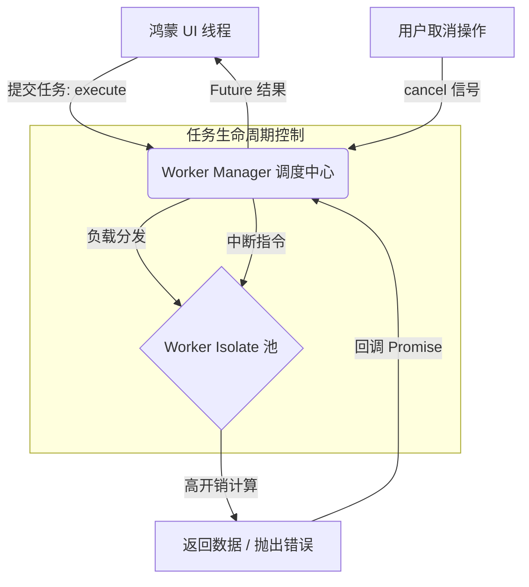

欢迎加入开源鸿蒙跨平台社区：[https://openharmonycrossplatform.csdn.net](https://openharmonycrossplatform.csdn.net)。

# Flutter for OpenHarmony：worker_manager — 构建鸿蒙端的“超级并发大脑”


## 前言

在维护复杂的鸿蒙（OpenHarmony）应用（如包含实时滤镜预览的相机、超大规模数据排序、或是高频的加解密通讯）时，开发者不仅需要将任务移出主线程，更需要对这些“工人（Workers）”进行精细化管理。简单的单次 `Isolate` 创建不仅昂贵，而且缺乏取消（Cancel）机制。

`worker_manager` 是一款为 Flutter 量身定制的高级任务调度库。它不仅维护了一个常驻的 `Isolate` 线程池，最大的核心杀手锏是：**支持取消正在执行的任务**。在 Flutter for OpenHarmony 的高性能适配架构中，它是处理动态、高并发、非阻塞计算任务的最佳拍档。

## 一、原理解析 / 概念介绍

### 1.1 基础模型

`worker_manager` 通过内部的任务队列和状态机，实现了主线程对后台 Worker 的完美控制。



### 1.2 核心特性

- **任务取消支持**：这是其相比 `compute` 的最大优势。如果用户离开页面，立即取消耗时的计算，节省鸿蒙端 CPU 资源。
- **动态池化管理**：根据鸿蒙设备的硬件能力（CPU 核心数）自动调整后台 Worker 数量。
- **极佳的 API 体验**：使用 `execute` 代替原始繁琐的监听。

## 二、核心 API / 工具详解

### 2.1 依赖引入

在鸿蒙工程的 `pubspec.yaml` 中添加以下依赖：

```yaml
dependencies:
  worker_manager: ^6.0.0 # 建议根据最新稳定版安装
```

### 2.2 要点讲解

💡 **技巧**：在鸿蒙端初始化时，首要步骤是让管理器感知环境。

```dart
import 'package:worker_manager/worker_manager.dart';

Future<void> initHarmonyWorkers() async {
  // ✅ 推荐做法：预先初始化
  await workerManager.init();
}

// 💡 提示：计算函数必须是全局或静态方法
String heavyProcessing(String data) {
  // 模拟极高强度的鸿蒙数据处理
  return data.split('').reversed.join();
}
```

## 三、典型应用场景

### 3.1 场景一：鸿蒙端图片后期处理
在应用中实现一个实时素描滤镜，每当用户调整参数时，即时取消旧的解析任务，并发起新参数的计算，确保响应不卡顿。

### 3.2 场景二：分布式的海量离线数据同步
针对从鸿蒙远端设备拉取回的超大 JSON 数组进行分词和本地仓库写入。

## 四、OpenHarmony 平台适配挑战

### 4.1 硬件核心数的自适应
鸿蒙手机核心数从 4 核到 8 核不等。

✅ **适配建议**：
1. **控制并行上限**：在使用 `workerManager.init()` 时，建议手动设置 `threadingCount`（通常为逻辑核心数减 1 或 2），给鸿蒙系统的后台系统进程留足余量。
2. **处理资源争抢**：针对低电量模式下的鸿蒙端，可以适度调用 `workerManager.dispose()` 归还资源。

## 五_、综合实战演示

下面演示了一个如何在鸿蒙端执行一个可随时取消的长时计算任务：

```dart
import 'package:flutter/material.dart';
import 'package:worker_manager/worker_manager.dart';

class HarmonyWorkerLab extends StatefulWidget {
  const HarmonyWorkerLab({super.key});

  @override
  State<HarmonyWorkerLab> createState() => _HarmonyWorkerLabState();
}

class _HarmonyWorkerLabState extends State<HarmonyWorkerLab> {
  Cancelable<String>? _currentTask;

  void _startTask() {
    // ✅ 提交可取消的任务
    _currentTask = workerManager.execute(() => heavyProcessing("OpenHarmony Optimization"));
    
    _currentTask!.then((result) {
      if (mounted) ScaffoldMessenger.of(context).showSnackBar(SnackBar(content: Text('计算结果: $result')));
    });
  }

  void _stopTask() {
    // ✅ 杀手锏功能：中止鸿蒙后台计算
    _currentTask?.cancel();
    print('已中止后台繁重任务，节省鸿蒙能耗！');
  }

  @override
  Widget build(BuildContext context) {
    return Scaffold(
      appBar: AppBar(title: const Text('动态并发实验室')),
      body: Center(
        child: Column(
          children: [
            ElevatedButton(onPressed: _startTask, child: const Text('开始高强度任务')),
            const SizedBox(height: 20),
            ElevatedButton(onPressed: _stopTask, child: const Text('立即取消任务', style: TextStyle(color: Colors.red))),
          ],
        ),
      ),
    );
  }
}
```

## 六、总结

`worker_manager` 让鸿蒙应用步入了“算力自由”的新阶段。它完美的任务控制能力，让高强度的计算不再成为用户体验的“负担”。

✅ **核心建议**：
1. **全局统筹**：整个应用共享一个 `workerManager` 全局实例。
2. **配合热启动**：在鸿蒙欢迎页（Splash Screen）提前调用 `init()`，让并发环境“热身”就绪。

📦 **参考资源**：源码已托管。

🌐 **欢迎加入**：[开源鸿蒙跨平台开发者社区](https://openharmonycrossplatform.csdn.net)
