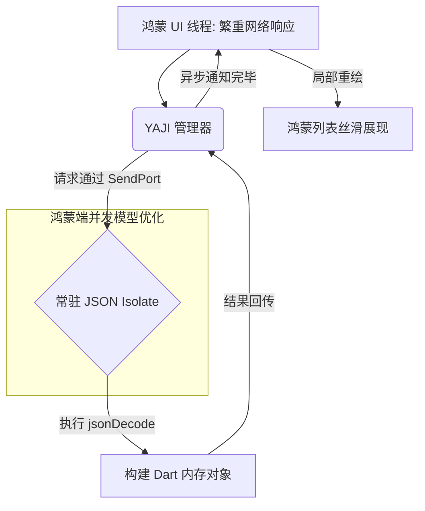

欢迎加入开源鸿蒙跨平台社区：[https://openharmonycrossplatform.csdn.net](https://openharmonycrossplatform.csdn.net)。

# Flutter for OpenHarmony：yet_another_json_isolate — 为鸿蒙应用注入极致“异步”基因


## 前言

在鸿蒙（OpenHarmony）环境下的应用迭代中，复杂的业务逻辑往往离不开庞大的 JSON 数据交换。当后端返回一个包含数千个节点、大小达数兆字节（MB）的 JSON 字符串时，直接在主线程（UI Thread）调用 `jsonDecode` 会导致长达数百毫秒的阻塞。在刷新率为 90Hz 甚至 120Hz 的鸿蒙旗舰设备上，这瞬间的卡顿足以让用户的顺滑感荡然无存。

虽然 Flutter 官方提供了 `compute` 函数，但其每次调用创建/销毁 Isolate 的开销在高频场景下仍有优化空间。`yet_another_json_isolate` 专门针对后端数据解析场景，提供了一个常驻的、预分配工作线程的 JSON 解析器。在 Flutter for OpenHarmony 的极致性能调优中，它是消除“掉帧”顽疾的杀手锏。

## 一、原理解析 / 概念介绍

### 1.1 基础模型

该库通过维护一个后台空闲的 Isolate，并使用高效的消息传递机制，实现了 JSON 处理的“外包”。



### 1.2 核心价值

- **零初始化开销**：通过常驻 Worker 避免了重复冷启动 Isolate 的高额成本。
- **简单易用**：类似于 `jsonDecode` 的 API 设计，几乎无学习成本。
- **内存安全**：在独立线程解析数据，减少了主线程由于处理巨型字符串导致的内存峰值压力。

## 二、核心 API / 工具详解

### 2.1 依赖引入

在鸿蒙工程的 `pubspec.yaml` 中添加：

```yaml
dependencies:
  yet_another_json_isolate: ^1.1.0
```

### 2.2 要点讲解

💡 **技巧**：在鸿蒙端初始化时，首要步骤是开启解析服务。

```dart
import 'package:yet_another_json_isolate/yet_another_json_isolate.dart';

// ✅ 推荐做法：创建全局解析实例
final harmonyJsonIsolate = YAJsonIsolate();

Future<void> prepareHarmonyApp() async {
  // 在 APP 启动阶段开启后台 Isolate
  await harmonyJsonIsolate.initialize();
}

void processBigData(String rawJson) async {
  // 零阻塞解析
  final Map<String, dynamic> data = await harmonyJsonIsolate.decode(rawJson);
  print('解析成功！');
}
```

## 三、典型应用场景

### 3.1 场景一：鸿蒙级超级 APP 首页
针对集合了数十个频道、海量推荐位的大型 JSON 聚合协议，将其解析任务彻底后台化，保证首页滚动过程中即便触发数据加载也绝不掉帧。

### 3.2 场景二：分布式的离线缓存同步
在接收到来自鸿蒙分布式总线的批量状态同步数据时，通过异步 JSON 反序列化，确保设备间的通信不影响本地操作。

## 四、OpenHarmony 平台适配挑战

### 4.1 数据的线程隔离拷贝
Isolate 之间传递数据本质上是内存拷贝。

✅ **适配建议**：
1. **控制传递频率**：针对碎片化的小 JSON，建议直接在主线程处理。仅当 JSON 字符串超过一定阈值（建议 50KB 以上）时，才动用 `yet_another_json_isolate`。
2. **及时释放**：在鸿蒙应用退后台或内存极度紧张时，可以调用 `dispose()` 停止后台解析线程，通过牺牲计算便利性来换取系统稳定性。

## 五_、综合实战演示

下面演示了一个在鸿蒙端处理大型复杂 JSON 数据的异步流示例：

```dart
import 'package:flutter/material.dart';
import 'package:yet_another_json_isolate/yet_another_json_isolate.dart';

class HarmonyJsonLab extends StatefulWidget {
  const HarmonyJsonLab({super.key});

  @override
  State<HarmonyJsonLab> createState() => _HarmonyJsonLabState();
}

class _HarmonyJsonLabState extends State<HarmonyJsonLab> {
  String _status = "等待解析...";

  void _runStressTest() async {
    setState(() => _status = "后台解析中，UI 保持连贯...");
    
    // 模拟一个万级节点的巨型 JSON
    final bigJson = '{"items": ${List.generate(10000, (i) => '{"id": $i, "val": "data"}').toString()}}';

    // ✅ 利用 Isolate 解析
    final data = await harmonyJsonIsolate.decode(bigJson);
    
    setState(() {
      _status = "解析完毕，数据量: ${(data['items'] as List).length} 条";
    });
  }

  @override
  Widget build(BuildContext context) {
    return Scaffold(
      appBar: AppBar(title: const Text('并发解析实验室')),
      body: Center(
        child: Column(
          children: [
            const LinearProgressIndicator(), // 💡 如果解析阻塞，这个动画会卡住
            const SizedBox(height: 50),
            Text(_status),
            ElevatedButton(onPressed: _runStressTest, child: const Text('启动巨量数据解析'))
          ],
        ),
      ),
    );
  }
}
```

## 六、总结

`yet_another_json_isolate` 是追求极致性能的鸿蒙应用“必选项”。它通过对 Isolate 机制的灵活运用，让“沉重”的 JSON 变换变得轻若鸿毛。

✅ **核心建议**：
1. **全局单例化**：全应用范围内共享一个 `YAJsonIsolate` 实例。
2. **结合 Dio**：在 Dio 的 `Transformer` 中注入此解析器，实现网络数据的自动、静默、异步解析。

📦 **参考源码**：见 AtomGit。

🌐 **欢迎加入**：[开源鸿蒙跨平台开发者社区](https://openharmonycrossplatform.csdn.net)
