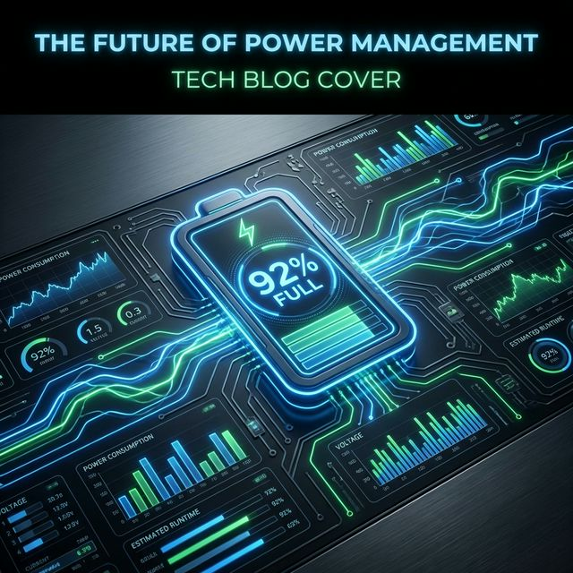

# Flutter for OpenHarmony 实战：battery_plus 实时电力监控与低功耗逻辑



## 前言

在移动端开发中，电量是极其宝贵的资源。尤其是对于 **HarmonyOS NEXT** 这种注重全场景协同、长续航体验的系统，应用是否具备“电量感知能力”是其能否被系统推荐、降低用户电量焦虑的关键。

**`battery_plus`** 是社区最成熟的电量交互方案，它不仅能告诉你“还剩多少电”，还能帮你监听“是否插上了快充”，从而动态调整应用的后台任务强度。

---

## 一、 battery_plus 的核心能力

### 1.1 获取实时电量
返回 0 到 100 之间的整数，精度高且频率稳定。

### 1.2 监听充电状态
分为 `charging`（充电中）、`discharging`（放电中）、`full`（充满）以及 `unknown`。

---

## 二、 集成指南

### 2.1 添加依赖
```yaml
dependencies:
  battery_plus: ^7.0.0
```

---

## 三、 实战：构建鸿蒙智能省电模块

### 3.1 监听电量变化

```dart
import 'package:battery_plus/battery_plus.dart';

final Battery _battery = Battery();

// 💡 提示：在鸿蒙端监听电量，建议在 initState 开启订阅
_battery.onBatteryStateChanged.listen((BatteryState state) {
  // 当系统处于“正在充电”时，可以开启高频数据刷新
  if (state == BatteryState.charging) {
    _enableHeavyTasks();
  } else {
    // 💡 核心：当处于放电状态且电量过低时，主动下调应用帧率或关闭动效
    _enterPowerSavingMode();
  }
});
```

### 3.2 动态电量查询

```dart
Future<void> checkLevel() async {
  final level = await _battery.batteryLevel;
  if (level < 20) {
    // 弹窗提醒用户保存草稿，防止因关机导致数据丢失
    _showBackupDialog();
  }
}
```

---

## 四、 鸿蒙平台的适配要点

### 4.1 电池健康度差异
鸿蒙系统对电池健康度的隐私策略非常严格。虽然 `battery_plus` 暂时只能获取基础电量，但在适配鸿蒙应用时，应避免频繁轮询接口，建议始终使用 `onBatteryStateChanged` 的流式监听来节省计算资源。

### 4.2 熄屏功耗管理
鸿蒙应用在后台会被挂起。当应用处于非活跃状态时，即便 `battery_plus` 监听存活，也不应再进行耗电量大的磁盘写操作。

---

## 五、 完整示例代码

以下演示了一个“鸿蒙电力仪表盘”实时展示手机电量与充电状态：

```dart
import 'package:flutter/material.dart';
import 'package:battery_plus/battery_plus.dart';

class BatteryMonitorPage extends StatefulWidget {
  const BatteryMonitorPage({super.key});

  @override
  State<BatteryMonitorPage> createState() => _BatteryMonitorPageState();
}

class _BatteryMonitorPageState extends State<BatteryMonitorPage> {
  final Battery _battery = Battery();
  int _level = 0;
  BatteryState _state = BatteryState.unknown;

  @override
  void initState() {
    super.initState();
    _initBattery();
    _battery.onBatteryStateChanged.listen((state) {
      if(mounted) setState(() => _state = state);
    });
  }

  void _initBattery() async {
    final level = await _battery.batteryLevel;
    setState(() => _level = level);
  }

  @override
  Widget build(BuildContext context) {
    return Scaffold(
      appBar: AppBar(title: const Text('鸿蒙电力管家(Plus)')),
      body: Center(
        child: Column(
          mainAxisAlignment: MainAxisAlignment.center,
          children: [
            Stack(
              alignment: Alignment.center,
              children: [
                CircularProgressIndicator(
                  value: _level / 100,
                  strokeWidth: 10,
                  color: _level > 20 ? Colors.green : Colors.red,
                ),
                Text('$_level%', style: const TextStyle(fontSize: 24, fontWeight: FontWeight.bold)),
              ],
            ),
            const SizedBox(height: 30),
            Text('充电状态：${_state == BatteryState.charging ? "⚡️ 正在极速快充" : "🔋 正在电池供电"}'),
          ],
        ),
      ),
    );
  }
}
```

<!-- IMAGE_PLACEHOLDER: 鸿蒙手机显示的半圆形电量百分比进度条与动态更新的充电状态图标截图 -->
<!-- 内容: 展示接入电源后 UI 图标瞬间从放电状态变为充电状态的交互反馈 -->

## 六、 总结

电量管理是应用品质的基石。通过 `battery_plus`，我们不仅能够给用户直观的电量反馈，更能基于电量数据制定出一套科学的应用“生存策略”。在一个高性能的鸿蒙应用中，学会“看脸色（看电量）行驶”，是走向大厂架构师的必经之路。

---

**欢迎加入开源鸿蒙跨平台社区**：[开源鸿蒙跨平台开发者社区](https://openharmonycrossplatform.csdn.net)
