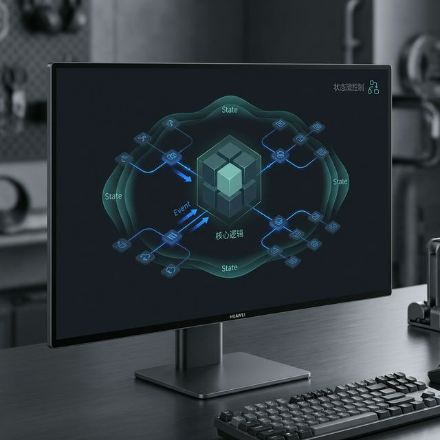
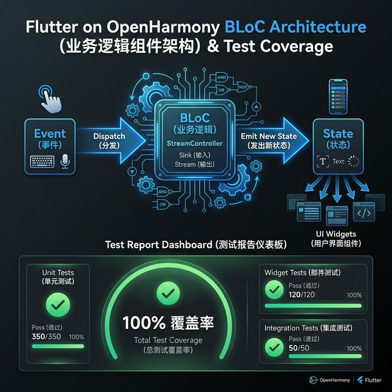

# 企业级架构进化：Flutter flutter_bloc 在鸿蒙开发中的逻辑解耦与工程实践



## 前言

当应用规模从单页面 Demo 演进到百万级日活的复杂系统（如金融、电商类 App）时，状态管理就不再仅仅是“传个值”那么简单，而是一场关于**逻辑解耦、可测试性与团队协作**的革命。

`flutter_bloc` 结合了 BLoC (Business Logic Component) 模式，是目前 Flutter 生态中最具工业美感的状态管理方案。本文将带大家在 **HarmonyOS NEXT** 环境下，通过 BLoC 模式构建一个健壮的架构模型。

---

## 一、 为什么在鸿蒙大型项目中选择 BLoC？

### 1.1 绝对的 UI 与 逻辑分离
UI 只需要发送 **Event (事件)**，并根据 **State (状态)** 进行重建。这与鸿蒙系统的分布式解耦思想高度契合。

### 1.2 单元测试的最佳拍档
由于 BLoC 不直接依赖 `BuildContext`（纯 Dart 类），我们可以针对鸿蒙业务逻辑编写 100% 覆盖率的单元测试，而无需启动真机环境。



---

## 二、 工程集成

### 2.1 添加依赖
```yaml
dependencies:
  flutter_bloc: ^8.1.3
  equatable: ^2.0.5 # 核心：用于状态对比，避免无效重绘
```

### 2.2 核心三要素定义
以一个简单的“电影收藏”逻辑为例：

- **Event**: 用户的原始意图（如 `AddMovieEvent`）。
- **State**: UI 的各种切面（如 `LoadingState`、`LoadedState`、`ErrorState`）。
- **BLoC**: 逻辑处理器，将 Event 映射为 State 流。

---

## 三、 实战：构建电影收藏 BLoC

### 3.1 定义状态 (利用 Equatable)
```dart
abstract class MovieState extends Equatable {
  @override
  List<Object> get props => [];
}

class MovieInitial extends MovieState {}
class MovieLoading extends MovieState {}
class MovieLoaded extends MovieState {
  final List<String> list;
  MovieLoaded(this.list);
  @override
  List<Object> get props => [list]; // 💡 只有列表内容变了，UI 才刷新
}
```

### 3.2 逻辑实现
```dart
class MovieBloc extends Bloc<MovieEvent, MovieState> {
  MovieBloc() : super(MovieInitial()) {
    on<LoadMovieEvent>((event, emit) async {
      emit(MovieLoading());
      // 模拟鸿蒙本地数据库查询 (sqflite)
      await Future.delayed(const Duration(seconds: 1)); 
      emit(MovieLoaded(['流浪地球', '长津湖']));
    });
  }
}
```

---

## 四、 鸿蒙 UI 层接入：BlocProvider 与 BlocBuilder

良好的架构应当在页面顶层注入依赖。

```dart
Widget build(BuildContext context) {
  return BlocProvider(
    create: (context) => MovieBloc()..add(LoadMovieEvent()), // 💡 注入并初始化加载
    child: Scaffold(
      body: BlocBuilder<MovieBloc, MovieState>(
        builder: (context, state) {
          if (state is MovieLoading) return const Center(child: CircularProgressIndicator());
          if (state is MovieLoaded) {
            return ListView.builder(
              itemCount: state.list.length,
              itemBuilder: (context, i) => ListTile(title: Text(state.list[i])),
            );
          }
          return const Text('出现错误');
        },
      ),
    ),
  );
}
```

<!-- IMAGE_PLACEHOLDER: 鸿蒙手机运行 BLoC 示例，加载时转圈、加载后瞬间呈现列表且无抖动的丝滑截图 -->
<!-- 类型: 截图 -->
<!-- 内容: 展示状态管理带来的界面的确定性 -->

---

## 五、 鸿蒙端的工程化进阶

### 5.1 全局拦截 (BlocObserver)
在鸿蒙应用的根目录，我们可以注入一个全局拦截器，监控整个应用的业务流转情况，这对于定位鸿蒙线上 Bug 极其有用。

```dart
class MyBlocObserver extends BlocObserver {
  @override
  void onTransition(Bloc bloc, Transition transition) {
    super.onTransition(bloc, transition);
    // 💡 可以在这里把状态变更日志记录到鸿蒙本地文件，辅助排查问题
    print('${bloc.runtimeType} -> $transition');
  }
}

void main() {
  Bloc.observer = MyBlocObserver();
  runApp(const MyApp());
}
```

---

## 六、 总结

`flutter_bloc` 让鸿蒙跨平台应用具备了“工业级”的生命力：
1.  **逻辑清晰**：新同事入职，只需看 Event 和 State 即可上手业务。
2.  **极度稳定**：通过强类型的状态流，规避了鸿蒙复杂 UI 下常见的空指针或竞态条件。
3.  **高性能**：借助于 `Equatable`，仅重绘必须更新的组件。

---

> 📦 **完整代码已上传至 AtomGit**：[open-harmony-examples/flutter_bloc](https://atomgit.com/dragonbady/open-harmony-examples/tree/main/examples/flutter-ohos-bloc)
>
> 🌐 **欢迎加入开源鸿蒙跨平台社区**：[开源鸿蒙跨平台开发者社区](https://openharmonycrossplatform.csdn.net)
