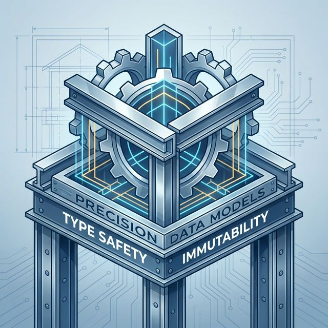

# Flutter for OpenHarmony 实战：built_value 强类型模型生成与不可变数据模型



## 前言

在处理鸿蒙应用复杂的后端业务逻辑时，数据的**准确性**和**一致性**是开发者最大的痛点。JavaScript 风格的 Model 类虽然灵活，但容易在运行时抛出各种莫名其妙的 `null` 异常。

**`built_value`** 通过一套严密的“不可变（Immutable）”数据模型生成机制，配合 `built_value_generator`，能让你的鸿蒙 Flutter 应用在模型层拥有像 Java 甚至 Swift 一样的强类型安全保证。

---

## 一、 为什么在鸿蒙开发中推崇 BuiltValue？

### 1.1 自动生成 JSON 解析
它能自动生成完备的序列化/反序列化逻辑，再复杂的嵌套 JSON 在它面前也只是几行代码。

### 1.2 值相等性 (Value Equality)
两个由 `built_value` 生成的对象，只要属性值相同，它们就相等（`==` 为 true）。这在处理鸿蒙 UI 的 `diff` 算法时极大地提升了效率。

### 1.3 不可变性
对象一旦创建就无法修改，防止了在多线程或复杂回调中数据被意外修改导致的诡异 Bug。

---

## 二、 集成指南

### 2.1 添加依赖
```yaml
dependencies:
  built_value: ^8.9.2

dev_dependencies:
  build_runner: ^2.4.11
  built_value_generator: ^8.12.3
```

---

## 三、 实战：构建鸿蒙应用的用户数据模型

### 3.1 定义模型抽象类

```dart
import 'package:built_value/built_value.dart';
import 'package:built_value/serializer.dart';

part 'user_model.g.dart';

abstract class UserModel implements Built<UserModel, UserModelBuilder> {
  int get id;
  String get name;
  String? get nickname; // 允许为空

  UserModel._();
  factory UserModel([void Function(UserModelBuilder) updates]) = _$UserModel;
  
  static Serializer<UserModel> get serializer => _$userModelSerializer;
}
```

### 3.2 运行生成器
在终端执行以下命令：
```bash
dart run build_runner build
```

---

## 四、 鸿蒙平台的工程实践

### 4.1 结合 Chopper 的序列化
在适配鸿蒙 REST 接口时，建议在 `ChopperClient` 中注入 `BuiltValueConverter`。这样从接口获取的 JSON 解析到不可变的 `Built` 对象可以实现全链路零代码手写，大幅降低出错率。

### 4.2 性能与生成的副作用
在大规模生成代码后，可能会导致 `ohos/entry/build-profile.json5` 中的 native 符号索引压力。建议通过 `build.yaml` 限制生成的范围，只针对特定的 `models/*.dart` 进行代码生成。

---

## 五、 完整示例代码

以下演示了如何使用 BuiltValue 生成的对象创建一个带有属性校验的鸿蒙用户卡片：

```dart
import 'package:flutter/material.dart';

// 💡 提示：在实际项目中需要运行生成脚本
class MockUser {
  final int id;
  final String name;

  MockUser({required this.id, required this.name});
  
  // 模拟 built_value 提供的 rebuild 模式
  MockUser copyWith({String? name}) {
    return MockUser(id: this.id, name: name ?? this.name);
  }
}

class BuiltValueDemoPage extends StatefulWidget {
  const BuiltValueDemoPage({super.key});

  @override
  State<BuiltValueDemoPage> createState() => _BuiltValueDemoPageState();
}

class _BuiltValueDemoPageState extends State<BuiltValueDemoPage> {
  var _user = MockUser(id: 1, name: "张工 @ 鸿蒙生态");

  void _updateUser() {
    setState(() {
      // 💡 模拟 built_value 不可变数据的更新方式
      _user = _user.copyWith(name: "开发者: 跨平台实战大师");
    });
  }

  @override
  Widget build(BuildContext context) {
    return Scaffold(
      appBar: AppBar(title: const Text('鸿蒙不可变模型实验室')),
      body: Center(
        child: Column(
          mainAxisAlignment: MainAxisAlignment.center,
          children: [
            const Icon(Icons.security, size: 80, color: Colors.teal),
            const SizedBox(height: 20),
            Text('UID: ${_user.id}', style: const TextStyle(fontWeight: FontWeight.bold)),
            Text('用户名: ${_user.name}', style: const TextStyle(fontSize: 20)),
            const SizedBox(height: 40),
            ElevatedButton(
              onPressed: _updateUser,
              child: const Text('触发不可变更新'),
            ),
          ],
        ),
      ),
    );
  }
}
```

<!-- IMAGE_PLACEHOLDER: 控制台展示经过 built_value 序列化后的强类型 JSON 数据包结构的截图 -->
<!-- 内容: 展示 Model 类属性与 JSON key 完美映射且无报错的终端回显 -->

## 六、 总结

`built_value` 让数据模型不再是随意的“字典”，而是变成了具备严格契约的编程实体。在追求工程质量的鸿蒙跨平台应用中，使用它可以屏蔽掉 90% 以上由空安全或类型不一致导致的业务漏洞。虽然引入成本较高，但对于立志打造长生命周期产品的开发者来说，这绝对是一笔极其划算的投资。

---

**欢迎加入开源鸿蒙跨平台社区**：[开源鸿蒙跨平台开发者社区](https://openharmonycrossplatform.csdn.net)
