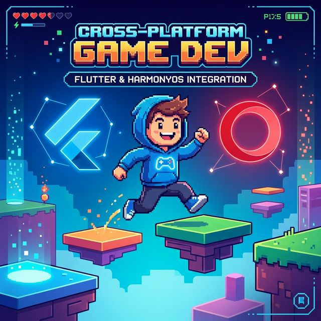

# Flutter for OpenHarmony 实战：Flame 2D 游戏开发引擎适配之旅



## 前言

谁说 Flutter 只能写 UI 界面？在强大的 **Flame** 引擎支撑下，Flutter 同样可以开发出性能卓越的 2D 游戏。当 Flutter 遇到 **HarmonyOS NEXT**，凭借华为对底层图形性能的优化，Flame 游戏在鸿蒙上展现出了惊人的流畅度。

本文将带你走进鸿蒙 2D 游戏开发大门，看看如何让你的 Flame 角色在鸿蒙系统上跳跃起舞。

---

## 一、 Flame 引擎核心概念

### 1.1 游戏循环 (Game Loop)
Flame 的核心是 `GameLoop`。它不断地调用 `update` 和 `render`，确保物理计算与画面渲染的绝对同步。

### 1.2 组件系统 (FCS)
Flame 采用类似 Flutter 的组件树结构（Flame Component System）。你可以通过 `add()` 将背景、精灵、碰撞体层层嵌套，非常符合声明式编程习惯。

---

## 二、 集成指南

### 2.1 添加依赖
```yaml
dependencies:
  flame: ^1.35.0
```

---

## 三、 实战：在鸿蒙上跑出第一个游戏场景

### 3.1 创建游戏类

```dart
import 'package:flame/game.dart';
import 'package:flame/components.dart';

class MyOhosGame extends FlameGame {
  @override
  Future<void> onLoad() async {
    // 加载资源并添加角色
    final sprite = await loadSprite('hero.png');
    add(SpriteComponent(
      sprite: sprite,
      size: Vector2(100, 100),
      position: size / 2,
    ));
  }
}
```

### 3.2 注入到应用入口

```dart
void main() {
  runApp(GameWidget(game: MyOhosGame()));
}
```

---

## 四、 鸿蒙平台的性能调优

### 4.1 帧率锁定与垂直同步
鸿蒙旗舰屏支持 120Hz 刷新。在 Flame 中，你可以通过调整 `update` 逻辑中的 `dt`（delta time）来确保在不同刷新的真机上物体移动速率一致：
```dart
@override
void update(double dt) {
  super.update(dt);
  character.position += velocity * dt; // 💡 必须基于 dt 物理更新
}
```

### 4.2 音效延迟优化
鸿蒙系统的声音子系统有其独特的缓存机制。在使用 `flame_audio` 时，建议预先调用 `FlameAudio.bgm.play` 加载到缓存，避免点击瞬间发生微小延迟。

---

## 五、 完整示例代码

以下演示了一个简单的方块移动游戏，针对鸿蒙触控进行了适配：

```dart
import 'package:flutter/material.dart';
import 'package:flame/game.dart';
import 'package:flame/components.dart';
import 'package:flame/input.dart';

class SimpleGame extends FlameGame with TapDetector {
  late SpriteComponent player;

  @override
  Future<void> onLoad() async {
    player = SpriteComponent()
      ..size = Vector2.all(80.0)
      ..position = size / 2
      ..anchor = Anchor.center
      ..paint = (Paint()..color = Colors.orange); // 演示用，实战中加载图
    add(player);
  }

  @override
  void onTapDown(TapDownInfo info) {
    // 💡 监听触控，让角色平滑向点击位置移动
    player.position = info.eventPosition.global;
  }
}

class GameDemoPage extends StatelessWidget {
  const GameDemoPage({super.key});

  @override
  Widget build(BuildContext context) {
    return Scaffold(
      appBar: AppBar(title: const Text('鸿蒙 2D 游戏实验室(Flame)')),
      body: GameWidget(game: SimpleGame()),
    );
  }
}
```

<!-- IMAGE_PLACEHOLDER: 鸿蒙手机上流畅运行的 2D 精灵运动画面截图 -->
<!-- 内容: 展示 Flame 渲染的 GameWidget 在真机屏幕上的无缝衔接效果 -->

## 六、 总结

Flame 为 Flutter 开发者开启了通往游戏开发的世界之窗。在 **HarmonyOS NEXT** 强大的硬件加速驱动下，以往被认为性能吃紧的跨平台游戏，现在也能展现出丝滑的原生质感。快来编写你的第一个鸿蒙小游戏吧！

---

**欢迎加入开源鸿蒙跨平台社区**：[开源鸿蒙跨平台开发者社区](https://openharmonycrossplatform.csdn.net)
