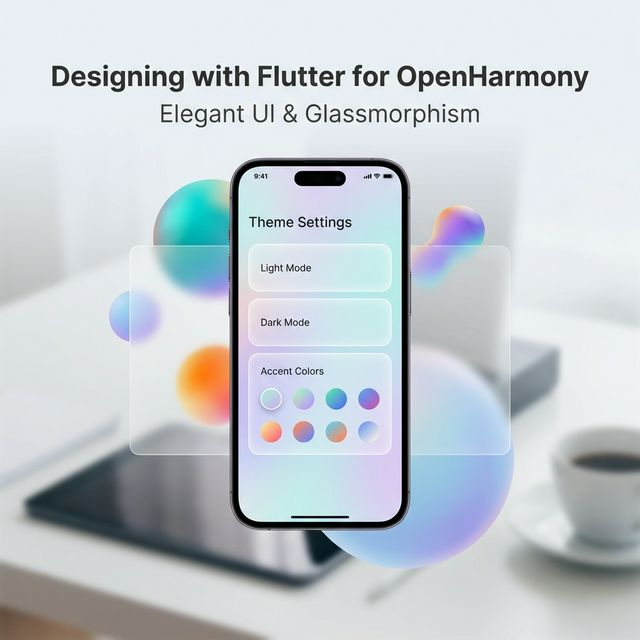

# Flutter for OpenHarmony 实战：flex_color_scheme 打造极致鸿蒙美学 UI



## 前言

一个商业级 App 的核心竞争力，除了功能，还有那“一眼万年”的精致感。在 **HarmonyOS NEXT** 这个强调“元服务”与“沉浸式体验”的系统中，如何快速构建出一套符合系统美学又具备品牌辨识度的颜色体系？

**`flex_color_scheme`** 是 Flutter 社区最强大的主题化方案，它能让你用极少的代码，瞬间交付出媲美原生鸿蒙高级感的主题布局。

---

## 一、 为什么选择 flex_color_scheme？

### 1.1 精选色板
它内置了几十种工业级调色板，省去了开发者自己在 HSL 和 RGB 之间挣扎的痛苦。

### 1.2 真正的一键“深色模式”
它对 Material 3 的支持是像素级的，能完美处理深色模式下色彩的对比度与层次感。

---

## 二、 集成指南

### 2.1 添加依赖
```yaml
dependencies:
  flex_color_scheme: ^8.4.0
```

---

## 三、 实战：构建“鸿蒙蓝”风格主题

### 3.1 极简配置

```dart
import 'package:flex_color_scheme/flex_color_scheme.dart';

MaterialApp(
  // 💡 技巧：选择 FlexScheme.harmony 风格（或近似的 OhosBlue）
  theme: FlexThemeData.light(scheme: FlexScheme.blue),
  darkTheme: FlexThemeData.dark(scheme: FlexScheme.blue),
  themeMode: ThemeMode.system, // 跟随鸿蒙系统深浅设置
  home: const MyHome(),
);
```

### 3.2 深度定制
你可以对圆角、AppBat 阴影等进行系统级重置：

```dart
theme: FlexThemeData.light(
  scheme: FlexScheme.deepBlue,
  surfaceMode: FlexSurfaceMode.levelSurfacesLowScaffold,
  blendLevel: 7,
  subThemesData: const FlexSubThemesData(
    blendOnLevel: 10,
    blendOnColors: false,
    useTextTheme: true,
    useM2StyleDividerInM3: true,
    // 💡 提示：适配鸿蒙推荐的圆角规范
    defaultRadius: 12.0, 
  ),
  visualDensity: FlexColorScheme.comfortablePlatformDensity,
  useMaterial3: true,
),
```

---

## 四、 鸿蒙端的视觉适配

### 4.1 沉浸式状态栏与导航栏
在鸿蒙系统上，我们追求应用背景与系统条的“无界交互”。通过 `flex_color_scheme` 定义好颜色后，配合 `SystemUiOverlayStyle` 自动获取主题色，可以实现完美的沉浸效果。

### 4.2 响应式颜色映射
鸿蒙设备拥有极佳的色彩表现，建议开启 `FlexColorScheme` 的 `trueColors` 选项，让 OLED 屏幕的色彩饱和度得到最真实的还原。

---

## 五、 完整示例代码

以下代码演示了如何创建一个带有“鸿蒙雅致蓝”质感的主题预览页：

```dart
import 'package:flutter/material.dart';
import 'package:flex_color_scheme/flex_color_scheme.dart';

class ThemePreviewPage extends StatelessWidget {
  const ThemePreviewPage({super.key});

  @override
  Widget build(BuildContext context) {
    return Scaffold(
      appBar: AppBar(title: const Text('鸿蒙美学实验室(Flex)')),
      body: Center(
        child: Column(
          mainAxisAlignment: MainAxisAlignment.center,
          children: [
            const Card(
              elevation: 4,
              child: Padding(
                padding: EdgeInsets.all(30),
                child: Text('鸿蒙沉浸式 UI 卡片', style: TextStyle(fontSize: 20)),
              ),
            ),
            const SizedBox(height: 30),
            ElevatedButton(
              onPressed: () {},
              child: const Text('品牌主操作按钮'),
            ),
            const SizedBox(height: 20),
            Row(
              mainAxisAlignment: MainAxisAlignment.center,
              children: [
                ActionChip(label: const Text('标签 A'), onPressed: () {}),
                const SizedBox(width: 10),
                ActionChip(label: const Text('标签 B'), onPressed: () {}),
              ],
            ),
          ],
        ),
      ),
    );
  }
}
```

<!-- IMAGE_PLACEHOLDER: 同一组合 UI 在 Light 模式与 Dark 模式下精准切换且色域平衡的对比截图 -->
<!-- 内容: 展示卡片、按钮在 flex_color_scheme 驱动下呈现出的高级色彩质感 -->

## 六、 总结

UI 决定了一个 App 的“性格”。通过 `flex_color_scheme`，我们能以极低的维护成本，在 **HarmonyOS NEXT** 上复刻出华为官方级的视觉水准。这种对审美的极致追求，才是优秀开发者跳出“CRUD”怪圈的分水岭。

---

**欢迎加入开源鸿蒙跨平台社区**：[开源鸿蒙跨平台开发者社区](https://openharmonycrossplatform.csdn.net)
