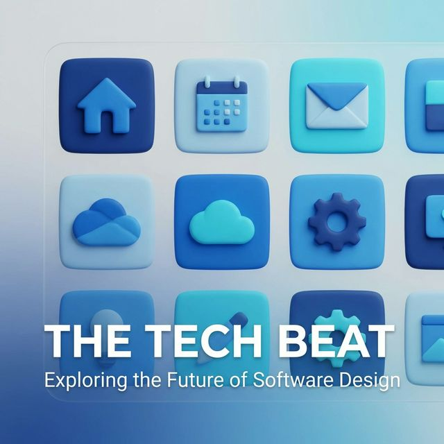

# Flutter for OpenHarmony 实战：fluentui_system_icons 微软风格图标库适配指南



## 前言

在应用开发中，图标（Icon）是 UI 传达信息的灵魂。虽然 Flutter 默认集成了 Material Icons，但在追求更加精致、具有现代感甚至商务质感的 **HarmonyOS NEXT** 应用设计中，微软出品的 **FluentUI System Icons** 凭借其统一的线条美学和极高的一致性，成为了许多高端应用的首选。

本文将演示如何在鸿蒙 Flutter 应用中集成这一高质量图标库，提升应用的国际化设计水准。

---

---

## 一、 为什么在鸿蒙开发中首选 FluentUI System Icons？

### 1.1 跨越平台的“普世美学”
Fluent UI 是微软新一代设计系统，不仅在 Windows 和 Office 场景中广泛使用，其图标造型圆润、笔触细腻且具有极强的识别度。在 **HarmonyOS NEXT** 这一强调“轻量”与“秩序”的设计体系下，Fluent 图标的极简线条能与鸿蒙的卡片式布局产生绝佳的“设计共振”。

### 1.2 物理级支持的 Regular 与 Filled 风格
该库对每一个图标都提供了 `Regular`（线性）和 `Filled`（面性）两个版本。这在鸿蒙应用的 Tab 切换、深色模式映射以及“选中态”反馈中提供了物理级别的视觉一致性支撑。

### 1.3 极度丰富的语义覆盖
涵盖了从基础导航、多媒体控制到复杂的商业办公（如 Outlook 风格的日历、协同图标）等 4000+ 种组合。对于缺少专业 UI 支持的独立开发者或敏捷开发团队来说，这是一个开箱即用的“设计资产库”。

---

## 二、 技术内幕：解析图标在鸿蒙端的渲染路径

### 2.1 字体图标 (Icon Font) 的本质
`fluentui_system_icons` 并不是以位图图片（PNG/SVG）的形式存在，而是封装在一个 **TrueType Font (TTF)** 字体文件中。每一个图标都对应字体中的一个 Unicode 码位。

### 2.2 渲染优势分析
1. **矢量缩放**：无论在鸿蒙手机还是 4K 智慧屏上，图标都能保持无限的边缘锐度，绝对不会出现模糊。
2. **内存极简**：加载几千个图标仅需读取一个几百 KB 的字体文件，比起加载数千张 PNG 图片，内存占用降低了 90% 以上。
3. **颜色灵活性**：开发者可以通过 Dart 的 `color` 属性实时改变图标颜色，轻松适配鸿蒙的系统强调色或品牌色。

---

## 三、 集成指南

### 2.1 添加依赖
在 `pubspec.yaml` 中增加以下配置：

```yaml
dependencies:
  fluentui_system_icons: ^1.1.273
```

---

---

## 四、 实战：构建鸿蒙风格的精致 UI 系统

### 4.1 核心图标资产的高级调用

```dart
import 'package:fluentui_system_icons/fluentui_system_icons.dart';

// 💡 技巧：利用 Fluent 图标构建具有商务质感的按钮
ElevatedButton.icon(
  onPressed: () {},
  icon: const Icon(FluentSystemIcons.ic_fluent_send_24_regular),
  label: const Text('发送邮件'),
  style: ElevatedButton.styleFrom(
    foregroundColor: Color(0xFF007DFF), // 鸿蒙品牌蓝
    backgroundColor: Colors.white,
    elevation: 0,
    side: BorderSide(color: Color(0xFF007DFF)),
  ),
),
```

### 4.2 针对鸿蒙深色模式的自动适配
结合鸿蒙系统的 `Brightness` 状态，动态映射图标风格：

```dart
Icon(
  Theme.of(context).brightness == Brightness.dark
    ? FluentSystemIcons.ic_fluent_weather_moon_filled
    : FluentSystemIcons.ic_fluent_weather_sunny_regular,
  size: 32,
)
```

---

## 四、 鸿蒙平台的视觉适配建议

### 4.1 像素对齐
由于 Fluent 图标是为微软生态设计的，在鸿蒙真机的高 PPI 屏幕下，建议将 `Icon` 的 `size` 设置为偶数（如 20, 24, 32），以获得最佳的边缘锐度。

### 4.2 符号化与无障碍
鸿蒙系统非常看重无障碍属性。在使用 `Icon` 时，务必填写 `semanticLabel`，确保鸿蒙系统的屏幕阅读器能够正确读出图标代表的含义：
```dart
Icon(
  FluentSystemIcons.ic_fluent_search_regular,
  semanticLabel: '搜索',
)
```

---

## 五、 完整示例代码

以下代码演示了一个带有 FluentUI 质感的鸿蒙应用底部导航栏：

```dart
import 'package:flutter/material.dart';
import 'package:fluentui_system_icons/fluentui_system_icons.dart';

class FluentIconDemoPage extends StatefulWidget {
  const FluentIconDemoPage({super.key});

  @override
  State<FluentIconDemoPage> createState() => _FluentIconDemoPageState();
}

class _FluentIconDemoPageState extends State<FluentIconDemoPage> {
  int _selectedIndex = 0;

  @override
  Widget build(BuildContext context) {
    return Scaffold(
      appBar: AppBar(title: const Text('鸿蒙 Fluent 图标实验室')),
      body: Center(
        child: Column(
          mainAxisAlignment: MainAxisAlignment.center,
          children: [
            const Icon(
              FluentSystemIcons.ic_fluent_flash_fg_filled,
              size: 100,
              color: Colors.orange,
            ),
            const SizedBox(height: 20),
            Text(
              '当前选中项索引: $_selectedIndex',
              style: const TextStyle(fontSize: 18),
            ),
          ],
        ),
      ),
      bottomNavigationBar: BottomNavigationBar(
        currentIndex: _selectedIndex,
        onTap: (index) => setState(() => _selectedIndex = index),
        type: BottomNavigationBarType.fixed,
        items: const [
          BottomNavigationBarItem(
            icon: Icon(FluentSystemIcons.ic_fluent_home_regular),
            activeIcon: Icon(FluentSystemIcons.ic_fluent_home_filled),
            label: '首页',
          ),
          BottomNavigationBarItem(
            icon: Icon(FluentSystemIcons.ic_fluent_mail_regular),
            activeIcon: Icon(FluentSystemIcons.ic_fluent_mail_filled),
            label: '消息',
          ),
          BottomNavigationBarItem(
            icon: Icon(FluentSystemIcons.ic_fluent_person_regular),
            activeIcon: Icon(FluentSystemIcons.ic_fluent_person_filled),
            label: '我的',
          ),
        ],
      ),
    );
  }
}
```

<!-- IMAGE_PLACEHOLDER: 鸿蒙手机底部导航栏使用 Fluent 风格图标在 Regular 与 Filled 之间平滑切换的截图 -->
<!-- 内容: 展示微软风格图标在鸿蒙 UI 中展现出的精致、统一的现代视觉效果 -->

## 七、 总结

`fluentui_system_icons` 为鸿蒙 Flutter 开发者提供了一个无需设计参与就能大幅提升应用质感的“捷径”。在 **HarmonyOS NEXT** 这个强调美的系统中，每一个图标的细节都是品质的体现。利用好微软的设计资产，能让你的鸿蒙应用在众多国产软件中脱颖而出。

---

> 📦 **完整代码已上传至 AtomGit**：[open-harmony-examples/flutter-ohos-fluent-icons](https://atomgit.com/dragonbady/open-harmony-examples/tree/main/examples/flutter-ohos-fluent-icons)
> 
> 🔗 **相关阅读推荐**：
> - [Microsoft Fluent UI 图标库官方设计规范](https://fluenticons.co/)
> - [鸿蒙应用图标与色彩设计语言指南](https://developer.huawei.com/consumer/cn/design/vibrant-design-color/)

🌐 **欢迎加入开源鸿蒙跨平台社区**：[开源鸿蒙跨平台开发者社区](https://openharmonycrossplatform.csdn.net)
