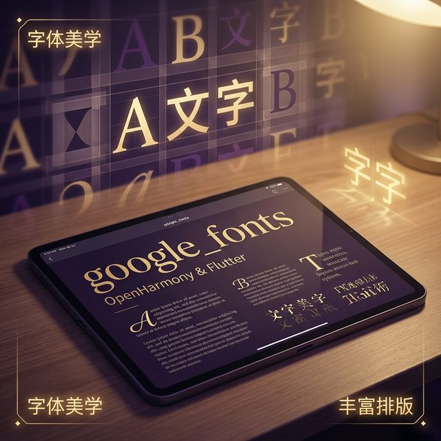

# 解锁鸿蒙视觉美学：Flutter google_fonts 动态字体加载与分发实战



## 前言

优秀的排版设计是提升 App 高级感的核心要素。在 Flutter 生态中，`google_fonts` 允许我们无需手动配置字体文件，即可通过简单的 API 直接使用上千种 Google 字体。

在 **HarmonyOS NEXT** 全新设计的“鸿蒙黑体”基础上，如何再融入丰富的个性化排版方案？本篇将手把手带你在鸿蒙系统下玩转 `google_fonts`，解决字体动态下载、离线预置及渲染性能等核心问题。

---

## 一、 Google Fonts 的核心优势

### 1.1 零门槛字体方案
无需下载 `.ttf` 或 `.otf` 并修改 `pubspec.yaml`，通过一行代码即可调用 Lato, Montserrat, Roboto 等全球知名设计师作品。

### 1.2 动态加载机制
字体文件在运行时从 Google 的 HTTP 终端下载。

<!-- IMAGE_PLACEHOLDER: 在鸿蒙手机上通过 google_fonts 渲染出的多变字体效果示例图 -->
<!-- 类型: 截图 -->
<!-- 内容: 展示 Lato, Oswald, Lobster 等字体的混排效果 -->

---

## 二、 集成步骤

### 2.1 添加依赖
在 `pubspec.yaml` 中增加引用：

```yaml
dependencies:
  flutter:
    sdk: flutter
  google_fonts: ^6.2.1 # 请确保适配 Flutter for OpenHarmony 的版本
```

### 2.2 网络权限声明 (重要！)
由于 `google_fonts` 需要动态下载字体，对于鸿蒙应用，我们需要在 `ohos/entry/src/main/module.json5` 中确保开启了互联网访问权限：

```json5
{
  "module": {
    "requestPermissions": [
      {
        "name": "ohos.permission.INTERNET"
      }
    ]
  }
}
```

---

## 三、 核心用法实战

### 3.1 基础调用
我们可以直接通过字体库名字对应的静态方法来生成 `TextStyle`。

```dart
import 'package:google_fonts/google_fonts.dart';

Text(
  '这是一段在鸿蒙上运行的动态字体',
  style: GoogleFonts.lato(
    textStyle: TextStyle(
      fontSize: 24,
      color: Colors.white,
      fontWeight: FontWeight.w700,
    ),
  ),
),
```

### 3.2 动态主题设置
你可以直接将 Google Fonts 设为整个应用的默认字体。

```dart
MaterialApp(
  theme: ThemeData(
    textTheme: GoogleFonts.notoSansTextTheme(
      Theme.of(context).textTheme, // 💡 配合鸿蒙原生文本主题，保持字号与规范对齐
    ),
  ),
  home: const MyHome(),
)
```

---

## 四、 离线模式：针对鸿蒙包体积优化

动态下载虽然方便，但在某些对稳定性要求极高（或网络受限）的场景下，我们可能需要“离线使用”。

### 4.1 预加载配置
1.  下载字体的 `.ttf` 文件。
2.  放入 `assets/google_fonts/`。
3.  在 `pubspec.yaml` 中配置：

```yaml
flutter:
  fonts:
    - family: Lato
      fonts:
        - asset: assets/google_fonts/Lato-Regular.ttf
```

此时 `google_fonts` 库会自动检测本地 Assets。如果存在该字体，将不再触发网络请求，这在我们在第 150 篇讲过的包体积优化实战中是一项关键技巧。

---

## 五、 鸿蒙环境下的进阶配置

### 5.1 字体平滑度优化
在高刷率（120Hz）的鸿蒙屏幕上，字体的微小模糊都可能被放大。
- ✅ **建议**：开启 `antiAlias` 属性确保边缘圆润。

### 5.2 兼容性处理
如果指定的 Google 字体因特殊字符集不支持，它会自动回退到鸿蒙系统的 **HarmonyOS Sans**。这保证了即使用户在断网状态下，应用也不会出现乱码或空白。

---

## 六、 完整示例分析：混合字体动效

```dart
import 'package:flutter/material.dart';
import 'package:google_fonts/google_fonts.dart';

class FontDemo extends StatelessWidget {
  @override
  Widget build(BuildContext context) {
    return ListView(
      padding: const EdgeInsets.all(20),
      children: [
        Text(
          'Splendid Movie 电影标题',
          style: GoogleFonts.lobster(fontSize: 48, color: Colors.blueAccent),
        ),
        const SizedBox(height: 20),
        Text(
          '正文排版（Roboto）: 这是一种高度通行的现代化设计排版，在鸿蒙端的表现非常稳健。',
          style: GoogleFonts.roboto(
            fontSize: 16,
            height: 1.5,
            fontWeight: FontWeight.w400,
            fontStyle: FontStyle.italic,
          ),
        ),
      ],
    );
  }
}
```

---

## 七、 总结

`google_fonts` 在 Flutter for OpenHarmony 中的落地非常顺畅：
1.  **极大地丰富了 UI 设计语言**。
2.  **通过网络权限和 Assets 备份，解决了多场景可用性问题**。
3.  **性能表现优异**，对复杂拉丁字符的排版算法在鸿蒙底层渲染下响应极快。

---

> 📦 **完整代码已上传至 AtomGit**：[open-harmony-examples/google_fonts](https://atomgit.com/dragonbady/open-harmony-examples/tree/main/examples/flutter-ohos-google-fonts)
>
> 🌐 **欢迎加入开源鸿蒙跨平台社区**：[开源鸿蒙跨平台开发者社区](https://openharmonycrossplatform.csdn.net)
