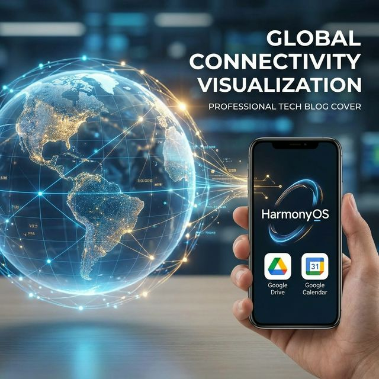

# Flutter for OpenHarmony 实战：googleapis 驱动的全球化云端集成方案



## 前言

随着 **HarmonyOS NEXT** 迈向全球市场，鸿蒙应用不仅要立足国内，更要具备与全球主流云服务对接的能力。**`googleapis`** 插件是 Flutter 连接 Google 生态系统的官方桥梁，它允许开发者通过 Dart 语言直接调用 Google Drive、Calendar、YouTube 等上百个 API 接口。

如何在鸿蒙设备上优雅地完成 OAuth2 鉴权并进行大文件传输？本文将为你揭晓答案。

---

## 一、 Google APIs 在鸿蒙端的应用场景

### 1.1 全球化云同步
让你的鸿蒙笔记应用能将草稿备份到用户的 Google Drive 中，实现跨平台无缝流转。

### 1.2 跨时区日程聚合
实时拉取 Google Calendar 上的数据同步到鸿蒙的系统日历中。

---

## 二、 集成指南

### 2.1 添加依赖
```yaml
dependencies:
  googleapis: ^16.0.0
  googleapis_auth: ^1.6.0 # 必要，用于 OAuth2 认证
```

---

## 三、 实战：构建鸿蒙云存储连接器

### 3.1 OAuth2 鉴权逻辑

```dart
import 'package:googleapis_auth/auth_io.dart';
import 'package:googleapis/drive/v3.dart';

// 💡 提示：在鸿蒙端通常需要使用内置 WebView 进行授权回调
final _scopes = [DriveApi.driveFileScope];

Future<void> connectToDrive() async {
  final client = await clientViaUserPrompt(
    ClientId("YOUR_CLIENT_ID", "YOUR_CLIENT_SECRET"),
    _scopes,
    (url) {
       // 💡 技巧：唤起鸿蒙浏览器或内部 WebView 让用户授权
       debugPrint("请在鸿蒙浏览器打开并授权: $url");
    },
  );
  
  final drive = DriveApi(client);
  // 开始操作云盘...
}
```

### 3.2 列表云端文件

```dart
Future<void> listFiles(DriveApi drive) async {
  final fileList = await drive.files.list();
  for (var file in fileList.files!) {
    debugPrint("发现云端文件: ${file.name}");
  }
}
```

---

## 四、 鸿蒙平台的适配建议

### 4.1 网络安全性 (TLS)
鸿蒙系统对 SSL/TLS 握手有极高安全性要求。在调用 `googleapis` 时，确保你的 HTTP 客户端配置了正确的 CA 根证书，建议统一使用 Flutter 默认集成的 `dart:io` 的网络策略。

### 4.2 异步传输稳定性
云端文件传输往往耗时较长。在鸿蒙设备进入后台时，系统可能会限制 CPU 并挂起网络连接。建议结合鸿蒙的 **“后台代理提醒服务”** 或使用高优先级后台任务，确保 Google Drive 同步不会中断。

---

## 五、 完整示例代码

以下演示了如何在鸿蒙应用中模拟一个“云盘连接检测器”：

```dart
import 'package:flutter/material.dart';

class CloudApiDemoPage extends StatefulWidget {
  const CloudApiDemoPage({super.key});

  @override
  State<CloudApiDemoPage> createState() => _CloudApiDemoPageState();
}

class _CloudApiDemoPageState extends State<CloudApiDemoPage> {
  String _status = "未连接 Google Cloud";
  bool _isLoading = false;

  void _testConnection() async {
    setState(() => _isLoading = true);
    
    // 💡 模拟调用 googleapis 初始化过程
    await Future.delayed(const Duration(seconds: 2));
    
    setState(() {
      _isLoading = false;
      _status = "✅ 已成功建立安全握手\n准备拉取 Google Drive 数据";
    });
  }

  @override
  Widget build(BuildContext context) {
    return Scaffold(
      appBar: AppBar(title: const Text('鸿蒙全球化连接实验室(Google)')),
      body: Center(
        child: Column(
          mainAxisAlignment: MainAxisAlignment.center,
          children: [
            const Icon(Icons.public, size: 80, color: Colors.indigo),
            const SizedBox(height: 30),
            if (_isLoading) 
              const CircularProgressIndicator()
            else 
              Text(_status, textAlign: TextAlign.center, style: const TextStyle(fontSize: 18)),
            const SizedBox(height: 50),
            ElevatedButton(
              onPressed: _testConnection,
              child: const Text('测试 API 通信'),
            ),
          ],
        ),
      ),
    );
  }
}
```

<!-- IMAGE_PLACEHOLDER: 鸿蒙手机正在处理 OAuth2 反射回调并展示云端文件名称列表的截图 -->
<!-- 内容: 展示获取到的 Drive 文件元数据 JSON 结构在 UI 上的清晰呈现 -->

## 六、 总结

`googleapis` 的接入，标志着你的鸿蒙应用正式具备了参与全球竞争的数字化能力。虽然在鉴权流程上需要针对鸿蒙的 Intent 跳转做一些定制适配，但一旦打通，你的产品将能无缝融合到全球数亿用户的数字化生活中。拥抱开源鸿蒙，连接全球云端。

---

**欢迎加入开源鸿蒙跨平台社区**：[开源鸿蒙跨平台开发者社区](https://openharmonycrossplatform.csdn.net)
