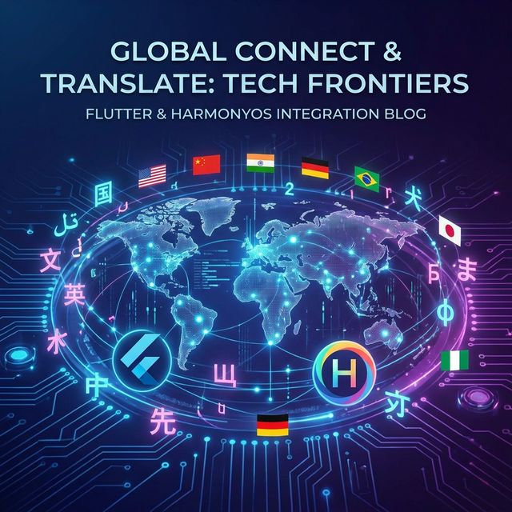

# Flutter for OpenHarmony 实战：intl 国际化方案与多语言适配



## 前言

随着 **HarmonyOS NEXT** 的全球化部署，如何让鸿蒙应用适配全球不同地区的语言、货币、日期格式，成为了每个出海开发者必备的技术栈。**`intl`** 插件作为 Flutter 官方推荐的国际化解决方案，不仅支持简单的字符串翻译，更深入到了 plural（复数）、gender（性别）以及区域性数字格式化。

本文将带你走进鸿蒙 Flutter 国际化的深度实战。

---

---

## 一、 为什么在鸿蒙端首选 intl？

### 1.1 工业级的标准翻译流
在 **HarmonyOS NEXT** 的全球化生态中，App 的翻译工作量通常是巨大的。`intl` 配合 `intl_generator` 提供了基于 **ICU (International Components for Unicode)** 标准的消息格式。这种格式不但支持简单的 key-value 映射，更能通过 `.arb`（Application Resource Bundle）文件完美对接诸如 Lokalise 或 Transifex 等全球专业翻译平台。

### 1.2 极度精准的局部化（Localization）能力
国际化（i18n）不仅仅是改文字，更是改“逻辑”。`intl` 能处理极其复杂的**复数形态（Plurals）**。例如，英文中“1 item”和“2 items”的后缀不同，而在俄语或阿拉伯语中，根据数量级（0个、1个、2个、几个、许多）会有多达 6 种不同的名词格变化。`intl` 将这些复杂的语言逻辑从业务代码中剥离，极大地提升了项目的健壮性。

### 1.3 物理级的系统环境对齐
它能深度感知鸿蒙系统的 Locale 环境变量。当用户在鸿蒙系统设置中切换地区时，`intl` 能自动更新货币符号（如从 ￥ 到 $）、日期排列顺序（如从 YYYY-MM-DD 到 MM/DD/YYYY），确保 App 与系统体验的高度融合。

---

## 二、 技术内幕：解析 intl 的“代码预生成”机制

### 2.1 静态与动态的权衡
普通的 `Map` 驱动多语言在运行时会有大量的字符串拼接开销。而 `intl_generator` 会扫描你的 Dart 代码，将 `Intl.message()` 定义转换为特定 Locale 的 Dart 函数类。这意味着在运行时，拉取一段翻译文本本质上是一次极速的类方法调用。

### 2.2 消息查找优先级算法
当你请求一个特定 Locale（如 `zh_HK_#Hant`）的文本时，`intl` 内部遵循一套严格的降级逻辑：
1. **精确匹配**：寻找繁体中文（香港）。
2. **广义匹配**：退而求其次寻找繁体中文。
3. **语言匹配**：寻找通用中文。
4. **兜底匹配**：返回默认语言（通常是英文）。这确保了应用在任何情况下都不会因为缺少某国翻译而显示空白。

---

## 三、 集成指南

### 2.1 添加依赖
```yaml
dependencies:
  flutter_localizations:
    sdk: flutter
  intl: ^0.20.2

dev_dependencies:
  intl_generator: ^0.2.2 # 用于代码生成
```

---

---

## 四、 实战：构建鸿蒙应用的高级全球化能力

### 4.1 处理复数 (Plurals) 与性别 (Gender)

```dart
// 💡 实战技巧：处理复杂的数量变幻
static String memberCount(int count) => Intl.plural(
  count,
  zero: '目前没有成员加入',
  one: '只有 1 位先锋加入了鸿蒙生态',
  other: '已有 $count 位先锋加入了鸿蒙系统',
  name: 'memberCount',
  args: [count],
);

// 💡 提示：根据性别动态调整称谓
static String greetByGender(String gender, String name) => Intl.gender(
  gender,
  male: '欢迎 $name 先生',
  female: '欢迎 $name 女士',
  other: '欢迎 $name',
  name: 'greetByGender',
  args: [name],
);
```

### 4.2 适配鸿蒙多时区联动
在鸿蒙端处理跨国出差场景时，我们需要手动指定时区转换：

```dart
import 'package:intl/date_symbol_data_local.dart';

void initOhosTime() async {
  // 💡 亮点：异步初始化本地日期符号数据
  await initializeDateFormatting('zh_CN', null);
  
  var now = DateTime.now();
  // 展现为：2026年2月9日 星期一
  print(DateFormat.yMMMMEEEEd('zh_CN').format(now));
}
```

---

## 四、 鸿蒙平台的适配要点

### 4.1 系统语言监听
鸿蒙系统的语言切换非常灵敏。在 Flutter 应用中，建议在 `MaterialApp` 的 `onGenerateTitle` 中引用国际化文本，这样当系统语言实时变更时，任务管理器中的应用名称也能瞬间更新。

### 4.2 特殊文本方向 (RTL)
如果应用需要适配中东地区语言（如阿拉伯语），`intl` 配合 Flutter 的 `Directionality` 系统，能够让整个鸿蒙 UI 自动横向镜像，适配从左到右的阅读习惯。

---

## 五、 完整示例代码

以下演示了一个支持中英双语切换的鸿蒙信息展示页：

```dart
import 'package:flutter/material.dart';
import 'package:flutter_localizations/flutter_localizations.dart';
import 'package:intl/intl.dart';

class IntlDemoPage extends StatelessWidget {
  const IntlDemoPage({super.key});

  @override
  Widget build(BuildContext context) {
    return MaterialApp(
      localizationsDelegates: const [
        GlobalMaterialLocalizations.delegate,
        GlobalWidgetsLocalizations.delegate,
        GlobalCupertinoLocalizations.delegate,
      ],
      supportedLocales: const [
        Locale('zh', 'CN'),
        Locale('en', 'US'),
      ],
      home: const IntlHome(),
    );
  }
}

class IntlHome extends StatelessWidget {
  const IntlHome({super.key});

  @override
  Widget build(BuildContext context) {
    // 💡 模拟不同语言环境下的文本输出
    final String currentTitle = Intl.select(
      Intl.defaultLocale ?? 'zh',
      {
        'zh': '鸿蒙国际化实战',
        'en': 'OHOS Global Lab',
      },
    );

    return Scaffold(
      appBar: AppBar(title: Text(currentTitle)),
      body: Center(
        child: Column(
          mainAxisAlignment: MainAxisAlignment.center,
          children: [
            const Icon(Icons.language, size: 80, color: Colors.blue),
            const SizedBox(height: 20),
            Text(
              '当前语言代码: ${Intl.getCurrentLocale()}',
              style: const TextStyle(fontSize: 18),
            ),
            const SizedBox(height: 10),
            Text(
              '格式化日期: ${DateFormat.yMMMMEEEEd().format(DateTime.now())}',
            ),
            const SizedBox(height: 30),
            ElevatedButton(
              onPressed: () {
                // 在实战中，这里通常是触发应用重启或更新 Locale
              },
              child: const Text('系统设置中切换语言测试'),
            ),
          ],
        ),
      ),
    );
  }
}
```

<!-- IMAGE_PLACEHOLDER: 鸿蒙手机在中文与英文系统设置下，应用内部日期格式与货币单位自动无缝转换的对比截图 -->
<!-- 内容: 展示 intl 后端逻辑如何驱动前端 UI 根据不同区域特征动态渲染不同的排版与文本内容 -->

## 七、 总结

国际化不仅是简单的语言翻译，更是对不同文化的礼貌。通过 `intl` 方案，我们能以模块化的方式管理鸿蒙应用的全球化资产。在全球共建 **HarmonyOS NEXT** 生态的浪潮中，具备“国际视野”的代码实现，将是你的应用走向世界、赢得海外用户的核心入场券。

---

> 📦 **完整代码已上传至 AtomGit**：[open-harmony-examples/flutter-ohos-intl](https://atomgit.com/dragonbady/open-harmony-examples/tree/main/examples/flutter-ohos-intl)
> 
> 🔗 **相关阅读推荐**：
> - [ICU 官方 MessageFormat 设计规范](https://unicode-org.github.io/icu/userguide/format_parse/messages/)
> - [鸿蒙应用多语言服务开发官方指南](https://developer.huawei.com/consumer/cn/doc/harmonyos-guides/localization-overview-0000001820919169)

🌐 **欢迎加入开源鸿蒙跨平台社区**：[开源鸿蒙跨平台开发者社区](https://openharmonycrossplatform.csdn.net)
