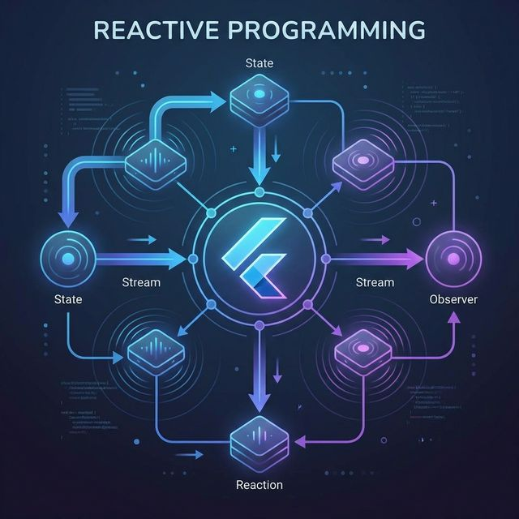

# Flutter for OpenHarmony 实战：MobX 声明式状态管理的高性能适配



## 前言

在中大型鸿蒙应用开发中，状态管理（State Management）是工程复杂度的分水岭。如果你厌倦了繁琐的 `Provider` 样板代码，或是觉得 `Bloc` 的流式操作过于沉重，那么 **`MobX`** 这种基于“观察者模式”的透明响应式方案，绝对会让你眼前一亮。

当 MobX 与 **HarmonyOS NEXT** 的高效并发机制结合，你的 Flutter 应用将展现出一种“数据驱动、UI 自动”的极致开发体验。

---

## 一、 MobX 的“三驾马车”

### 1.1 Observables (状态)
你应用中的实时数据。一旦状态改变，关联的一切都会自动更新。

### 1.2 Actions (动作)
唯一被允许改变状态的方式。在鸿蒙端，我们推荐通过 Action 统一管理复杂的业务变更。

### 1.3 Reactions (反应)
对状态改变的自动响应，最核心的体现就是 `Observer` Widget。

---

## 二、 集成指南

### 2.1 添加依赖
```yaml
dependencies:
  mobx: ^2.6.0
  flutter_mobx: ^2.3.0

dev_dependencies:
  build_runner: ^2.4.11
  mobx_codegen: ^2.7.0
```

---

## 三、 实战：构建鸿蒙应用的核心 Store

### 3.1 编写 Store（使用代码生成）

```dart
import 'package:mobx/mobx.dart';

// 关联生成的代码
part 'counter_store.g.dart';

class CounterStore = _CounterStore with _$CounterStore;

abstract class _CounterStore with Store {
  @observable
  int value = 0;

  @action
  void increment() {
    value++;
  }
}
```

### 3.2 UI 层的自动响应

```dart
final counter = CounterStore();

Observer(
  builder: (_) => Text(
    '当前点击次数: ${counter.value}',
    style: const TextStyle(fontSize: 24),
  ),
),
```

---

## 四、 鸿蒙平台的适配建议

### 4.1 异常捕获机制
鸿蒙系统对未捕获异常敏感。在使用 MobX 的异步 action（例如通过 Dio 请求鸿蒙云端接口）时，务必在 Store 层使用 `try-catch` 并在 `error` 状态中更新 UI 反馈，防止出现静默异常。

### 4.2 计算属性（Computed）的妙用
鸿蒙设备拥有极佳的处理器性能，但在处理长列表过滤时，建议大量使用 `@computed`。它具备缓存机制，只有当底层数据真正变化时才会触发表层组件重绘（Repaint），这能显著降低鸿蒙真机的温升。

---

## 五、 完整示例代码

以下演示了一个“鸿蒙响应式计数器”，通过 MobX 实现逻辑与 UI 的完全解耦：

```dart
import 'package:flutter/material.dart';
import 'package:flutter_mobx/flutter_mobx.dart';
import 'package:mobx/mobx.dart';

// 💡 提示：在实际项目中需要运行 build_runner 生成代码
class SimpleCounter {
  final _value = Observable(0);
  int get value => _value.value;

  late Action increment;

  SimpleCounter() {
    increment = Action(() {
      _value.value++;
    });
  }
}

class MobXDemoPage extends StatelessWidget {
  final counter = SimpleCounter();

  MobXDemoPage({super.key});

  @override
  Widget build(BuildContext context) {
    return Scaffold(
      appBar: AppBar(title: const Text('鸿蒙 MobX 响应式实验室')),
      body: Center(
        child: Column(
          mainAxisAlignment: MainAxisAlignment.center,
          children: [
            const Text('数据变动将精准驱动 UI 更新：'),
            const SizedBox(height: 20),
            // 💡 核心：仅包裹需要刷新的最小范围组件
            Observer(
              builder: (_) => Text(
                '${counter.value}',
                style: const TextStyle(fontSize: 60, fontWeight: FontWeight.bold),
              ),
            ),
          ],
        ),
      ),
      floatingActionButton: FloatingActionButton(
        onPressed: counter.increment,
        child: const Icon(Icons.add),
      ),
    );
  }
}
```

<!-- IMAGE_PLACEHOLDER: 点击悬浮按钮后，中间数字瞬间同步递增的流畅动效截图 -->
<!-- 内容: 展示 Observer 组件在毫秒级更新状态而无多余 Widget 重刷的性能诊断视图截图 -->

## 六、 总结

MobX 的美在于其“透明性”。在构建高性能的鸿蒙应用时，其提供的精密控制能力（精准渲染、状态可追溯、原子化更新）让开发者能够从烦琐的生命周期管理中解脱。如果你正在寻找一种既能保证性能，又能大幅提升生产力的状态管理框架，MobX 绝对是你在鸿蒙开发之旅中的上乘选择。

---

**欢迎加入开源鸿蒙跨平台社区**：[开源鸿蒙跨平台开发者社区](https://openharmonycrossplatform.csdn.net)
