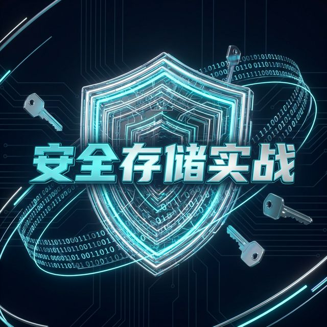

# Flutter for OpenHarmony 实战：flutter_secure_storage_ohos 安全存储凭据方案



## 前言：构建鸿蒙应用的“数字保险箱”

在 **HarmonyOS NEXT** 这一全新的“纯血鸿蒙”时代，安全性不再是一个可选项，而是系统的底层基因。对于开发者而言，如何妥善存储用户的 Token、支付密钥、甚至是敏感的身分凭证（PII），是衡量一个应用是否达到“商用级”门槛的关键指标。

传统的 `SharedPreferences` 及其变体虽然方便，但在底层由于缺乏硬件级加密，在设备被 Root 或遭遇极端系统级攻击时，明文数据极易泄露。为了填补这一安全裂缝，**`flutter_secure_storage_ohos`** 专项插件应运而生。它不是一个简单的封装，而是深度接入了鸿蒙内核级的 **HUKS（通用密钥库）关键资产服务**。

本文将深入从技术原理到代码实战，手把手带你为 Flutter 应用构建一道基于硬件 TEE（可信执行环境）的“数字保险箱”。

---

## 一、 为什么在鸿蒙开发中必须使用安全存储？

### 1.1 硬件隔离的可信执行环境 (TEE)
普通文件存储（如 XML 或 SQLite）本质上是应用进程的一块数据区域。而安全存储的数据由华为自研的 **TEE 安全子系统** 托管。这意味着，即便黑客拿到了系统的最高权限，由于解密主密钥被固化在硬件安全芯片（SE）中，物理层面上的数据隔离确保了密文即便被盗走也无法被暴力破解。

### 1.2 金融级安全认证底座
在鸿蒙系统中，安全中枢与用户的**生物识别信息**（如 3D 人脸、指纹）以及**锁屏密码**构成了联动保护链。这意味着，你可以配置数据仅在“用户本人解锁”后才允许读取。这为原本复杂的金融级认证提供了原生、极简的开发体验。

### 1.3 核心资产的“避风港”
普通的缓存或存储策略（如 `path_provider` 创建的文件）可能会在系统空间极度不足或用户执行清理操作时被风险性抹除。但 HUKS 管理的资产受到鸿蒙系统的“系统级特权保护”，只要应用不卸载，这些核心凭据就会始终如一地躺在硬件避风港中。

---

## 二、 技术内幕：拆解鸿蒙 HUKS 关键资产服务

**HUKS (HarmonyOS Universal KeyStore)** 是驱动整个鸿蒙安全生态的“中心轴”。

### 2.1 什么是全生命周期管理？
当你调用 `write` 接口时，HUKS 不仅仅是加密一条数据，它会经历以下过程：
1. **密钥对协商**：在硬件隔离区即时生成非对称或对称加密密钥。
2. **硬件级加密**：数据在 TEE 环境内完成加密，明文从未暴露在内存或普通的 CPU 总线中。
3. **资产封装**：数据以密文形式存储，并与当前 App 的签名指纹进行强绑定。

### 2.2 数据主权校验
每一笔读取请求，系统都会执行严格的权限风控检查。哪怕攻击者伪造了一个包名相同的应用尝试读取，由于其系统级签名指纹（Signing Certificate）无法匹配，HUKS 也会直接熔断请求。

---

## 三、 集成与基础实战

### 3.1 引入专项适配依赖
在 `pubspec.yaml` 中，我们建议使用经过 HarmonyOS NEXT 专项优化的依赖包，以确保在开发预览版或 beta 版系统上的稳定性：

```yaml
dependencies:
  flutter_secure_storage_ohos: ^1.0.0
```

### 3.2 基础存取流水线
由于专项插件对 `FlutterSecureStorage` 接口进行了完美适配，你可以保持既有的编码习惯，同时享受鸿蒙底层的安全加持：

```dart
import 'package:flutter_secure_storage_ohos/flutter_secure_storage_ohos.dart';

// 1. 初始化（建议单例模式以获得最佳性能）
final storage = const FlutterSecureStorage();

// 2. 写入敏感凭据
// 💡 说明：底层会自动映射到 HUKS 的关键资产存储逻辑
await storage.write(key: 'user_master_token', value: 'ohos_premium_7788abc');

// 3. 读取解密
String? token = await storage.read(key: 'user_master_token');

// 4. 清除与防腐处理
await storage.delete(key: 'user_master_token');
```

---

## 四、 鸿蒙安全性进阶：细腻的颗粒度控制

### 4.1 访问级别策略 (Access Control)
鸿蒙系统提供了极其细腻的访问控制位。虽然在 Flutter 抽象层中我们通过 `Options` 进行配置，但理解其背后的场景至关重要：

*   **`accessibleWhenUnlocked`**：这是最保险的选择。只有在屏幕亮起且用户完成解锁（面部/密码）后，HUKS 才会被“唤醒”并吐出数据。适合存储银行卡号、支付令牌。
*   **`accessibleAfterFirstUnlock`**：适合后台 Service。手机重启后用户只要解锁过一次，即便后面屏保锁定了，后台任务依然能读取数据。

### 4.2 工业级容灾捕获
在鸿蒙开发文档中，HUKS 明确说明了可能出现的“异常态”（例如用户在系统设置中重置了所有安全凭据）。开发者必须进行健壮性防御：

```dart
try {
  final val = await storage.read(key: 'key');
} on PlatformException catch (e) {
  // 💡 特殊错误码映射：asset_not_found
  // 这套错误码是由 flutter_secure_storage_ohos 专项封送的
  if (e.code == 'asset_not_found') {
    debugPrint("【安全审计】检测到安全资产丢失，可能需要引导重新授权");
  }
}
```

---

## 五、 实战示例：构建一个“鸿蒙安全中心”页面

接下来，我们将这些理论转化为一个符合视觉逻辑的“安全中心”实战页面。

```dart
import 'package:flutter/material.dart';
import 'package:flutter_secure_storage_ohos/flutter_secure_storage_ohos.dart';

class SecureStorageDemoPage extends StatefulWidget {
  const SecureStorageDemoPage({super.key});

  @override
  State<SecureStorageDemoPage> createState() => _SecureStorageDemoPageState();
}

class _SecureStorageDemoPageState extends State<SecureStorageDemoPage> {
  // 💡 亮点：实例化专项适配插件存储
  final _storage = const FlutterSecureStorage();
  final _controller = TextEditingController();
  String _statusMsg = "等待操作...";
  String? _decryptedVal;

  // 1. 写入操作：数据从未经手明文文件传输
  Future<void> _handleSave() async {
    if (_controller.text.isEmpty) return;
    await _storage.write(key: 'safe_key', value: _controller.text);
    setState(() {
      _statusMsg = "🔐 信息已硬件加密存入 HUKS 中枢";
      _decryptedVal = null;
      _controller.clear();
    });
  }

  // 2. 读取操作：由系统硬件层级执行授权解密
  Future<void> _handleRead() async {
    final val = await _storage.read(key: 'safe_key');
    setState(() {
      _decryptedVal = val;
      _statusMsg = val != null ? "🔓 解密成功！数据已从硬件安全单元取出" : "❓ 暂无憑據";
    });
  }

  @override
  Widget build(BuildContext context) {
    return Scaffold(
      appBar: AppBar(title: const Text('鸿蒙安全实验室')),
      body: SingleChildScrollView(
        padding: const EdgeInsets.all(24),
        child: Column(
          children: [
            const Icon(Icons.verified_user_rounded, size: 80, color: Colors.indigo),
            const SizedBox(height: 20),
            TextField(
              controller: _controller,
              decoration: const InputDecoration(
                labelText: '输入需要加密存储的信息',
                border: OutlineInputBorder(),
                prefixIcon: Icon(Icons.security),
              ),
            ),
            const SizedBox(height: 16),
            Text(_statusMsg, style: TextStyle(color: Colors.blueGrey[700])),
            if (_decryptedVal != null) 
              Container(
                margin: const EdgeInsets.symmetric(vertical: 20),
                padding: const EdgeInsets.all(16),
                color: Colors.indigo[50],
                child: Text("解密内容：$_decryptedVal", style: const TextStyle(fontWeight: FontWeight.bold)),
              ),
            const SizedBox(height: 30),
            Row(
              mainAxisAlignment: MainAxisAlignment.spaceEvenly,
              children: [
                ElevatedButton(onPressed: _handleSave, child: const Text('加密保存')),
                OutlinedButton(onPressed: _handleRead, child: const Text('读取解密')),
              ],
            ),
          ],
        ),
      ),
    );
  }
}
```

---

## 六、 总结与展望

安全感源于对底层的绝对掌控。

通过引入 **`flutter_secure_storage_ohos`** 专项方案，我们不仅仅是做到了“功能可用”，更是严格遵循了 **HarmonyOS NEXT** 对用户隐私数据管理的最高准则。在这个互联互通的全场景时代，这种基于硬件 TEE 的数据主权保护，将成为你应用在激烈竞争中建立专业化、信任感品牌形象的核心竞争力。

---

🌐 **欢迎加入开源鸿蒙跨平台社区**：[开源鸿蒙跨平台开发者社区](https://openharmonycrossplatform.csdn.net)
