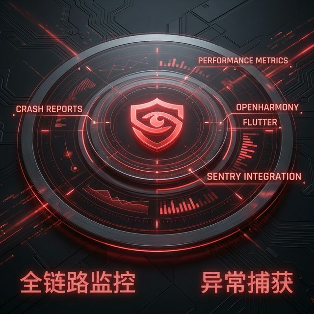

# Flutter for OpenHarmony 实战：Sentry 全链路监控与线上崩溃治理



## 前言

商业化 App 成功的基石不仅是绚丽的 UI，更是**极致的稳定性**。在鸿蒙设备型号日益多样化、系统版本迭代频繁的背景下，如何确保你的 Flutter 应用在千万级用户手中不出现“静默崩溃”？

仅靠本地日志是远远不够的。我们需要一套具备 **“案发现场还原”** 能力的监控系统。**Sentry** 不仅能捕获 Dart 层的空指针，更能深入鸿蒙 Native 层（C++）抓取系统级信号异常。本文将带你深度实战 Sentry 在 **HarmonyOS NEXT** 环境下的工程化落地。

---

## 一、 深度解析：Sentry 的“现场抓取”原理

### 1.1 双层监控机制
Sentry 在 Flutter for OpenHarmony 中是以“双头雕”模式运行的：
- **Dart Zone 监控**：通过 `runZonedGuarded` 或 Flutter 3.x 的 `PlatformDispatcher.onError` 捕获所有异步/同步未处理异常。
- **Native Signal 处理器**：在鸿蒙端，Sentry 会注册 `sigaction` 监听器，捕获 `SIGSEGV`（内存越界）或 `SIGABRT`（主动终止）等原生崩溃。

### 1.2 鸿蒙分布式追踪
鸿蒙系统的一大特性是“分布式”。Sentry 能够记录 App 的 **Breadcrumbs (面包屑)**，包括分布式总线的消息分发过程，这对于调试复杂跨端业务逻辑至关重要。

<!-- IMAGE_PLACEHOLDER: Sentry 监控架构图，展示 Dart Error 与 Native Exception 汇聚流程 -->
<!-- 类型: 流程图 -->
<!-- 内容: 展示异常从产生到上报 Sentry 云端的路径 -->

---

## 二、 工程实战：从接入到精细化运营

### 2.1 自动化符号表上传 (CI/CD 必备)
在生产环境下，如果不上传 **符号表 (Debug Symbols)**，你会看到一堆类似 `_kFunction_123` 的混淆代码。

💡 **技巧：使用 Shell 脚本自动化。**
在 `scripts` 目录下创建 `upload_symbols.sh`：
```bash
#!/bin/bash
# 1. 构建 HAP 并生成符号文件
flutter build hap --release --obfuscate --split-debug-info=./build/symbols

# 2. 调用 sentry-cli 批量上传
sentry-cli debug-files upload --project your-project-name ./build/symbols
```

### 2.2 用户信息关联 (User Context)
崩溃报告中如果能包含“谁崩溃了”，修复速度会提升一倍。

```dart
await Sentry.configureScope((scope) {
  scope.setUser(SentryUser(
    id: 'user_12345',
    username: '张工',
    email: 'zhang@example.com',
    ipAddress: '{{auto}}', // 自动获取当前网络 IP
  ));
  
  // 添加鸿蒙特定标签
  scope.setTag('ohos_api_version', '12');
  scope.setTag('is_foldable', 'true'); // 是否为折叠屏
});
```

---

## 三、 高级应用场景：业务异常监控

除了 Crash，某些致命的业务逻辑错误（如支付金额为负）也应该上报。

### 3.1 结合网络库 (Dio) 自动上报
```dart
class SentryInterceptor extends Interceptor {
  @override
  void onError(DioException err, ErrorInterceptorHandler handler) {
    if (err.response?.statusCode != 200) {
      Sentry.captureException(err, stackTrace: err.stackTrace);
    }
    super.onError(err, handler);
  }
}
```

### 3.2 自定义 Attachment (轨迹附件)
在鸿蒙上，你甚至可以附带一个 JSON 格式的本地状态快照，跟随异常一起上传。
```dart
Sentry.configureScope((scope) {
  scope.addAttachment(SentryAttachment.fromIntList(
    stateData,
    'last_state.json',
    contentType: 'application/json',
  ));
});
```

---

## 四、 鸿蒙生产环境避坑指南 (FAQ)

### 4.1 崩溃后导致数据丢失
**风险**：Sentry 的默认行为是异步上报。如果 App 在上报前就退出了，日志会丢失。
**方案**：开启 `options.flushTimeout = const Duration(seconds: 5)`，确保异常产生后有足够的阻塞时间完成网络请求。

### 4.2 流量消耗过大
**风险**：高频率的性能指标上报会消耗用户流量。
**方案**：在初始化时设置合理的采样率：
```dart
options.tracesSampleRate = 0.1; // 仅采集 10% 的性能数据
```

### 4.3 隐私合规与 IP 隐藏
⚠️ **警告**：鸿蒙应用市场对隐私合规检查极严。
**方案**：在初始化中设置 `options.sendDefaultPii = false`，禁止自动收集 IP 和设备序列号。

---

## 五、 总结

`Sentry` 就像是在鸿蒙设备里安置了一个 24 小时待命的“黑匣子”。它将不可预见的 Crash 转化为可追踪的故障单，极大地降低了团队的线上治理成本。对于致力于打造 **金融级稳定性** 的鸿蒙应用开发者来说，这是必做的一门功课。

---

> 📦 **完整代码已上传至 AtomGit**：[open-harmony-examples/sentry](https://atomgit.com/dragonbady/open-harmony-examples/tree/main/examples/flutter-ohos-sentry)
>
> 🌐 **欢迎加入开源鸿蒙跨平台社区**：[开源鸿蒙跨平台开发者社区](https://openharmonycrossplatform.csdn.net)
