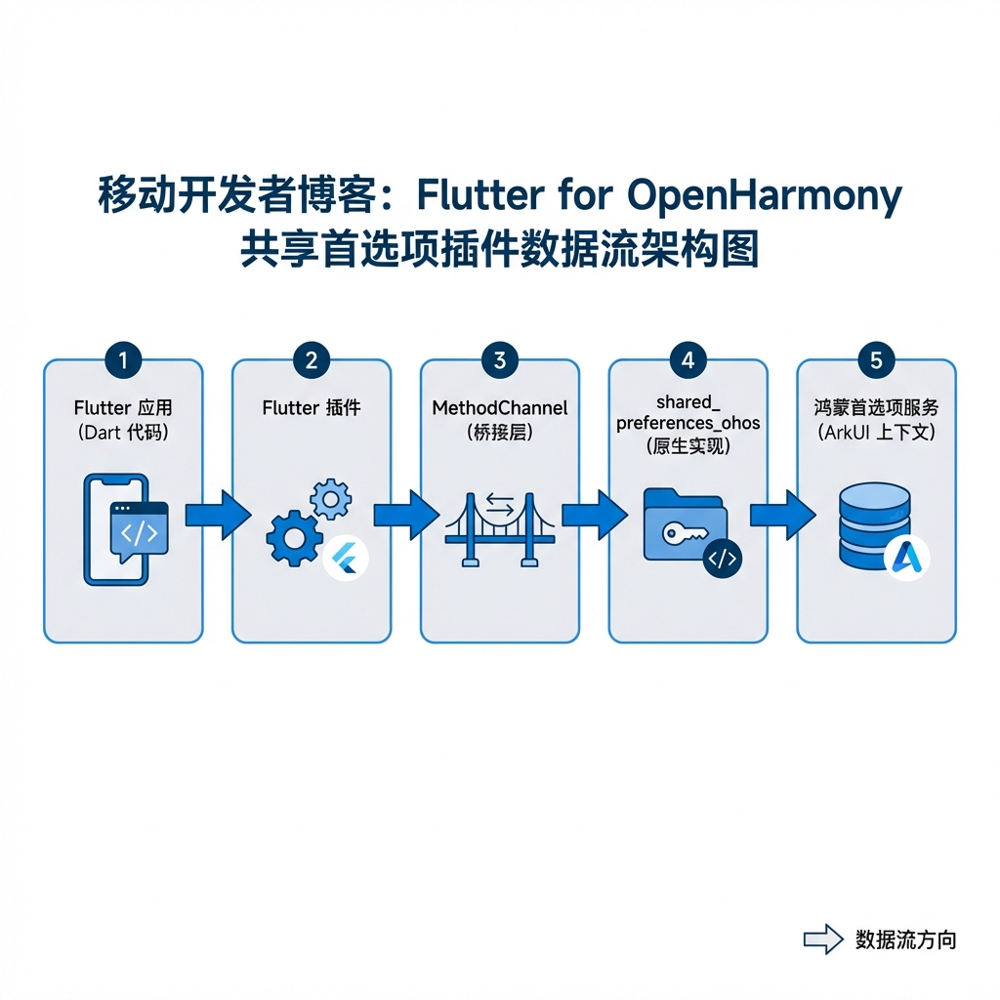

# Flutter for OpenHarmony 实战：Shared Preferences 轻量级数据存储全指南

## 前言

在移动应用开发中，我们经常需要存储一些轻量级的用户数据，比如用户是否登录、应用的主题颜色设置、用户的语言偏好等。在 Flutter 生态中，`shared_preferences` 是处理此类需求的首选插件。

随着 Flutter for OpenHarmony 的不断成熟，我们也可以在鸿蒙设备上流畅使用这一能力。本文将带大家从零开始，在 OpenHarmony 项目中集成、使用并封装 `shared_preferences`，同时深入探讨它与前端存储方案的异同，通过企业级封装实战提升你的代码质量。



---

## 一、 环境配置与依赖安装

在 OpenHarmony 平台上使用 Flutter 插件，最大的不同在于依赖源的配置。由于鸿蒙社区的适配包通常还在快速迭代中，我们往往需要直接指向 AtomGit 上的源码仓库。

### 1.1 引入鸿蒙适配包

我们需要用到 OpenHarmony TPC (Third Party Components) 提供的适配版本。该版本基于 `ohos.data.preferences` 原生能力实现，确保了数据读写的高效与安全。

请打开项目根目录下的 `pubspec.yaml` 文件，添加如下配置：

```yaml
dependencies:
  flutter:
    sdk: flutter

  # 1. 引入官方标准包（用于提供统一的 API 接口）
  shared_preferences: ^2.2.0

  # 2. 引入 OpenHarmony 平台适配实现
  shared_preferences_ohos:
    git:
      url: https://atomgit.com/openharmony-tpc/flutter_packages.git
      path: packages/shared_preferences/shared_preferences_ohos
```

> 📌 **注意**：
> *   `url` 指向了 AtomGit 上的 `flutter_packages` 聚合仓库，这是一个 Monorepo，包含了多个官方插件的鸿蒙适配版。
> *   `path` 必须精确指向 `packages/shared_preferences/shared_preferences_ohos` 子目录，否则 Pub 工具将无法找到 `pubspec.yaml`。

### 1.2 权限配置（可选）

对于简单的数据存储，OpenHarmony 的首选项（Preferences）通常不需要额外的敏感权限。但如果你的应用涉及跨设备数据同步等高级功能，或者需要存储敏感的用户隐私数据，建议查阅鸿蒙官方文档确认 `module.json5` 中的配置。对于当前的基础使用，**无需额外配置权限**，即插即用。

---

## 二、 基础实战：CRUD 操作详解

`SharedPreferences` 的操作非常直观，它基于 Key-Value（键值对）模型。底层在鸿蒙系统上映射为 XML 或二进制文件，适合存储配置类的**小数据**。

### 2.1 获取实例与写入数据

所有的写操作都是异步的（Future），建议配合 `await` 使用，以确保数据已成功落盘。

```dart
import 'package:shared_preferences/shared_preferences.dart';

Future<void> saveUserSettings() async {
  // 1. 获取实例（单例模式，内部会自动缓存）
  final SharedPreferences prefs = await SharedPreferences.getInstance();

  // 2. 写入不同类型的数据
  await prefs.setInt('counter', 10);              // 整数
  await prefs.setBool('is_dark_mode', true);      // 布尔值
  await prefs.setDouble('font_scale', 1.5);       // 浮点数
  await prefs.setString('user_name', 'OpenHarmony Dev'); // 字符串
  await prefs.setStringList('tags', ['Flutter', 'HarmonyOS']); // 字符串列表
  
  print('✅ 数据保存成功！');
}
```

### 2.2 读取数据

读取操作是同步的，这是因为 `getInstance` 时插件已通过 MethodChannel 将磁盘数据一次性加载到了内存中。

```dart
Future<void> loadUserSettings() async {
  final SharedPreferences prefs = await SharedPreferences.getInstance();

  // 读取数据，如果 key 不存在，返回 null
  final int? counter = prefs.getInt('counter');
  
  // 💡 技巧：使用 ?? 提供默认值，防止空指针异常
  final bool isDarkMode = prefs.getBool('is_dark_mode') ?? false;
  
  print('Counter: $counter, Dark Mode: $isDarkMode');
}
```

### 2.3 删除与清空

```dart
Future<void> clearData() async {
  final SharedPreferences prefs = await SharedPreferences.getInstance();

  // 删除单个 Key
  await prefs.remove('user_name');

  // 🔥 慎用：清空所有数据（通常仅在“退出登录且清除缓存”时使用）
  await prefs.clear();
}
```


---

## 三、 进阶实战：打造强类型的配置管理服务

在真实的大型项目中，到处写 `prefs.getString('key')` 既容易拼写错误（Magic String），又难以维护。下面我们通过一个 **单例模式** 的 `StorageService` 来封装这些逻辑，实现代码的解耦。

### 3.1 封装 PreferencesService

```dart
import 'package:shared_preferences/shared_preferences.dart';

class PreferencesService {
  // 私有构造函数，防止外部误实例化
  PreferencesService._();
  
  static final PreferencesService _instance = PreferencesService._();
  static PreferencesService get instance => _instance;

  late SharedPreferences _prefs;

  // 初始化方法，通常在 main.dart 中调用
  Future<void> init() async {
    _prefs = await SharedPreferences.getInstance();
  }

  // --- 定义所有的 Key 常量 ---
  static const String _kIsDarkMode = 'app_theme_mode';
  static const String _kLanguageCode = 'app_language';
  static const String _kUserToken = 'user_auth_token';

  // --- 强类型的 Getter/Setter ---

  // 主题设置：自动处理空值
  bool get isDarkMode => _prefs.getBool(_kIsDarkMode) ?? false;
  set isDarkMode(bool value) => _prefs.setBool(_kIsDarkMode, value);

  // 语言设置：提供默认值 'zh'
  String get languageCode => _prefs.getString(_kLanguageCode) ?? 'zh';
  set languageCode(String value) => _prefs.setString(_kLanguageCode, value);

  // 用户 Token：包含业务逻辑（存 null 即删除）
  String? get userToken => _prefs.getString(_kUserToken);
  Future<void> setUserToken(String? token) async {
    if (token == null) {
      await _prefs.remove(_kUserToken);
    } else {
      await _prefs.setString(_kUserToken, token);
    }
  }
}
```

### 3.2 在 App 中使用

首先在 `main.dart` 初始化：

```dart
void main() async {
  WidgetsFlutterBinding.ensureInitialized();
  
  // 等待初始化完成，确保后续同步读取不会报错
  await PreferencesService.instance.init();
  
  runApp(const MyApp());
}
```

在业务页面中调用：

```dart
// 读取
bool isDark = PreferencesService.instance.isDarkMode;

// 写入 - 就像操作普通变量一样简单，且带有类型检查
PreferencesService.instance.isDarkMode = !isDark;
```

这种封装方式极大地提高了代码的可读性和健壮性，是商业级项目的标配。

<!-- IMAGE_PLACEHOLDER: 主题切换效果 -->
<!-- 类型: GIF -->
<!-- 设备: 鸿蒙设备 -->
<!-- 内容: 点击按钮切换主题，并在重启 APP 后保持主题状态，演示持久化效果 -->

---

## 四、 技术对标：Shared Preferences vs LocalStorage vs Cookies

对于从 Web 前端（Vue/React）转到 Flutter for OpenHarmony 的开发者，理解这几种存储方式的区别至关重要。

| 特性 | Shared Preferences (Flutter/Native) | LocalStorage (Web) | Cookies (Web) |
| :--- | :--- | :--- | :--- |
| **鸿蒙底层** | **用户首选项 (Preferences)** | Webview 内核存储 | Webview 内核存储 |
| **数据类型** | int, double, bool, string, List | 仅 String | 仅 String |
| **网络传输** | **不随请求发送** | 不随请求发送 | **每次请求自动携带** |
| **访问速度** | 内存缓存 (极快) | 磁盘 IO (较快) | 磁盘 IO (较慢) |

### 4.1 核心差异深度剖析

#### （1）纯净性与安全性
SP 是纯粹的本地存储，**不会**像 Cookie 一样自动附加到 HTTP 请求头中。这意味着它更适合存储 UI 状态（如深色模式）。如果你需要实现“保持登录”，需要手动从 SP 读取 Token 并添加到 Dio 的 Header 中，这反而增加了 CSRF 攻击的防护能力。

#### （2）类型安全优势
SP 原生支持基础数据类型。在 LocalStorage 中存储布尔值 `true` 往往变成字符串 `"true"`，在读取时 `if ("false")` 依然为真，极易导致 Bug。而 SP 省去了手动 `JSON.parse` 的过程。

#### （3）鸿蒙底层机制
在 OpenHarmony 上，SP 底层映射为 `ohos.data.preferences`。它针对 JS UI 框架和 ArkUI 进行了深度优化，采用内存缓存 + 异步刷盘机制，且支持对数据变化的监听（虽然 Flutter 插件层暂时封装了由 Dart 侧管理），性能远高于简单的文件 IO。

---

## 五、 核心避坑指南 (Best Practices)

在实际开发中，不当使用 Shared Preferences 可能会导致卡顿或数据丢失。

### 5.1 避免在 build 方法中 await
`build()` 方法应该是纯同步且快速的。
*   ❌ **错误**：在 `build` 中调用 `await prefs.setInt(...)`。
*   ✅ **正确**：在 `onTap` 回调或 `initState` 生命周期中处理异步逻辑。

### 5.2 避免存储巨型 JSON
虽然 SP 可以存储 String，但它不是数据库。
*   ❌ **错误**：将几万条聊天记录 JSON 序列化后存入 SP。这会阻塞 UI 线程（因为加载是同步的）。
*   ✅ **正确**：对于大量结构化数据，请使用 `sqflite` 或鸿蒙原生的 **RDB (Relational Database)**。

### 5.3 单元测试中的 Mock
编写单元测试时，真正的 SP 无法在非真机环境运行。
*   ✅ **推荐**：使用 `SharedPreferences.setMockInitialValues({})` 来注入测试数据。

```dart
test('测试 Token 读取', () async {
  SharedPreferences.setMockInitialValues({
    'user_auth_token': 'mock_token_123'
  });
  final prefs = await SharedPreferences.getInstance();
  expect(prefs.getString('user_auth_token'), 'mock_token_123');
});
```

---

## 六、 完整示例：鸿蒙计数器 (持久化版)

下面是一个完整的计数器示例，展示了如何在鸿蒙设备上实现数据的持久化保存。

```dart
import 'package:flutter/material.dart';
import 'package:shared_preferences/shared_preferences.dart';

void main() {
  runApp(const MaterialApp(home: PersistentCounterPage()));
}

class PersistentCounterPage extends StatefulWidget {
  const PersistentCounterPage({super.key});

  @override
  State<PersistentCounterPage> createState() => _PersistentCounterPageState();
}

class _PersistentCounterPageState extends State<PersistentCounterPage> {
  int _counter = 0;
  final String _keyCounter = 'counter_value';

  @override
  void initState() {
    super.initState();
    _loadCounter(); // 初始化时加载数据
  }

  // 📥 读取数据
  Future<void> _loadCounter() async {
    final prefs = await SharedPreferences.getInstance();
    setState(() {
      _counter = prefs.getInt(_keyCounter) ?? 0;
    });
  }

  // 💾 保存数据
  Future<void> _incrementCounter() async {
    final prefs = await SharedPreferences.getInstance();
    final newValue = _counter + 1;
    
    // UI 更新
    setState(() {
      _counter = newValue;
    });
    
    // 持久化保存
    await prefs.setInt(_keyCounter, newValue);
  }

  @override
  Widget build(BuildContext context) {
    return Scaffold(
      appBar: AppBar(title: const Text('鸿蒙持久化计数器')),
      body: Center(
        child: Column(
          mainAxisAlignment: MainAxisAlignment.center,
          children: [
            const Text('你已经点击了这么多次：', style: TextStyle(fontSize: 18)),
            const SizedBox(height: 10),
            Text(
              '$_counter',
              style: const TextStyle(
                  fontSize: 48, 
                  fontWeight: FontWeight.bold, 
                  color: Colors.blue
              ),
            ),
            const SizedBox(height: 30),
            const Text(
              '即使重启应用，数字也不会丢失哦！',
              style: TextStyle(color: Colors.grey),
            ),
          ],
        ),
      ),
      floatingActionButton: FloatingActionButton(
        onPressed: _incrementCounter,
        tooltip: '增加',
        child: const Icon(Icons.add),
      ),
    );
  }
}
```

<!-- IMAGE_PLACEHOLDER: 鸿蒙计数器完整运行截图 -->
<!-- 类型: 截图 -->
<!-- 设备: 鸿蒙设备 -->
<!-- 内容: 展示 PersistentCounterPage 在 OpenHarmony 模拟器或真机上的运行状态 -->

---

## 七、 总结

`shared_preferences` 是 Flutter for OpenHarmony 开发中不可或缺的基础设施。通过引入 `shared_preferences_ohos` 适配包，我们可以无缝地将现有的 Flutter 经验迁移到鸿蒙生态中。

相比于 Web 前端的 LocalStorage，SP 提供了更规范的类型支持和更高效的底层实现。在实战中，推荐大家使用**单例模式**进行二次封装，以保持代码的整洁和可维护性。

---

> 📦 **完整代码已上传至 AtomGit**：[open-harmony-examples/shared_preferences_demo](https://atomgit.com/dragonbady/open-harmony-examples/tree/main/examples/shared_preferences_demo)
>
> 🌐 **欢迎加入开源鸿蒙跨平台社区**：[开源鸿蒙跨平台开发者社区](https://openharmonycrossplatform.csdn.net)
