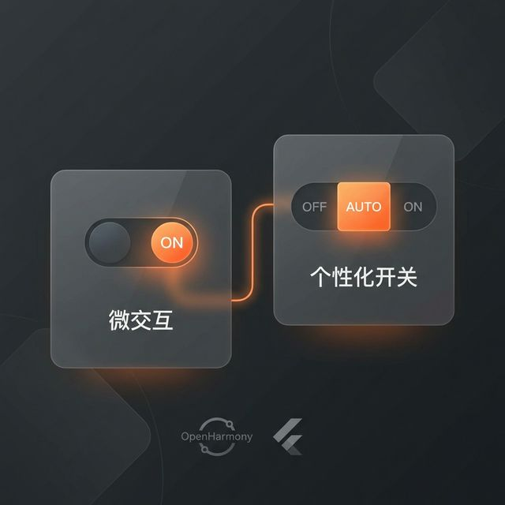

# Flutter for OpenHarmony 实战：toggle_switch 分段控件设计与复杂交互闭环



## 前言

开关（Toggle）是 UI 中最基础的控件。鸿蒙系统提供了原生的 `Switch` 组件，但如果你想要苹果风格的分段控件 (Segment Control) 或是带有自定义动画的开关？`toggle_switch` 插件正是为此而生。

本文将带你实战如何在 Flutter for OpenHarmony 项目中定制各种“微交互”开关，提升应用的高级感。

---

## 一、 Toggle Switch 的核心应用场景

### 1.1 模式切换
如网易云音乐首页的“推荐/直播”切换，或“黑暗/亮色”模式。

### 1.2 选项筛选
电商类应用的商品筛选（价格区间、销量排序）。`toggle_switch` 的多项选择（3+ 个标签）比普通的 `DropdownButton` 更直观、操作更高效。

---

## 二、 集成指南

### 2.1 添加依赖
```yaml
dependencies:
  toggle_switch: ^2.3.0
```

---

## 三、 实战：构建主题切换器

### 3.1 双态开关 (On/Off)
```dart
import 'package:toggle_switch/toggle_switch.dart';

ToggleSwitch(
  minWidth: 90.0,
  initialLabelIndex: 1,
  cornerRadius: 20.0,
  activeFgColor: Colors.white, // 高亮文字颜色
  inactiveBgColor: Colors.grey, // 未选中背景
  inactiveFgColor: Colors.white,
  totalSwitches: 2,
  labels: ['自动', '手动'],
  icons: [FontAwesomeIcons.robot, FontAwesomeIcons.hand],
  activeBgColors: [[Colors.blue], [Colors.pink]],
  onToggle: (index) {
    print('switched to: $index');
  },
);
```

### 3.2 多段开关 (Segmented Control)
```dart
ToggleSwitch(
  minWidth: 90.0,
  minHeight: 50.0,
  fontSize: 16.0,
  initialLabelIndex: 0,
  totalSwitches: 3,
  labels: ['小号', '中号', '大号'], // 衣服尺码选择
  onToggle: (index) {
    print('switched to: $index');
  },
);
```

---

## 四、 鸿蒙端的适配优化

### 4.1 响应式宽度
在平板或折叠屏上，硬编码 `minWidth` 可能会显得不协调。建议结合 `MediaQuery` 或 `LayoutBuilder` 动态设宽。

### 4.2 无障碍 (Accessibility)
鸿蒙系统的“屏幕朗读”功能对于视障用户非常重要。遗憾的是该插件对语义化的支持一般，建议在其外层包裹 `Semantics` 组件。

```dart
Semantics(
  label: '请选择性别',
  child: ToggleSwitch(...),
)
```

---

## 五、 完整示例代码

以下代码演示了如何在鸿蒙应用中实现一个支持性别选择的多态开关：

```dart
import 'package:flutter/material.dart';
import 'package:toggle_switch/toggle_switch.dart';
import 'package:font_awesome_flutter/font_awesome_flutter.dart';

class ToggleSwitchDemo extends StatelessWidget {
  const ToggleSwitchDemo({super.key});

  @override
  Widget build(BuildContext context) {
    return Scaffold(
      appBar: AppBar(title: const Text('鸿蒙开关组件演示')),
      body: Center(
        child: Column(
          mainAxisAlignment: MainAxisAlignment.center,
          children: [
            const Text('请选择你的偏好：', style: TextStyle(fontSize: 18)),
            const SizedBox(height: 20),
            ToggleSwitch(
              minWidth: 120.0,
              initialLabelIndex: 0,
              cornerRadius: 10.0,
              activeBgColors: [[Colors.blue], [Colors.pink], [Colors.orange]],
              activeFgColor: Colors.white,
              inactiveBgColor: Colors.grey[300],
              inactiveFgColor: Colors.black54,
              totalSwitches: 3,
              labels: ['男', '女', '保密'],
              icons: [FontAwesomeIcons.mars, FontAwesomeIcons.venus, FontAwesomeIcons.userSecret],
              onToggle: (index) {
                debugPrint('当前选择项索引: $index');
              },
            ),
          ],
        ),
      ),
    );
  }
}
```

<!-- IMAGE_PLACEHOLDER: 鸿蒙手机上点击开关后产生的平滑滑块平移效果截图 -->
<!-- 内容: 展示选中的彩色背景在不同标签间滑动的动效界面 -->

## 六、 总结

`toggle_switch` 是那种能极大提升“把玩感”的小组件。虽然功能单一，但在鸿蒙这样强交互的系统中，它的平滑过渡动画能让死板的设置项立刻灵动起来。

---

> 📦 **完整代码已上传至 AtomGit**：[open-harmony-examples/toggle_switch](https://atomgit.com/dragonbady/open-harmony-examples/tree/main/examples/flutter-ohos-toggle-switch)
>
> 🌐 **欢迎加入开源鸿蒙跨平台社区**：[开源鸿蒙跨平台开发者社区](https://openharmonycrossplatform.csdn.net)
