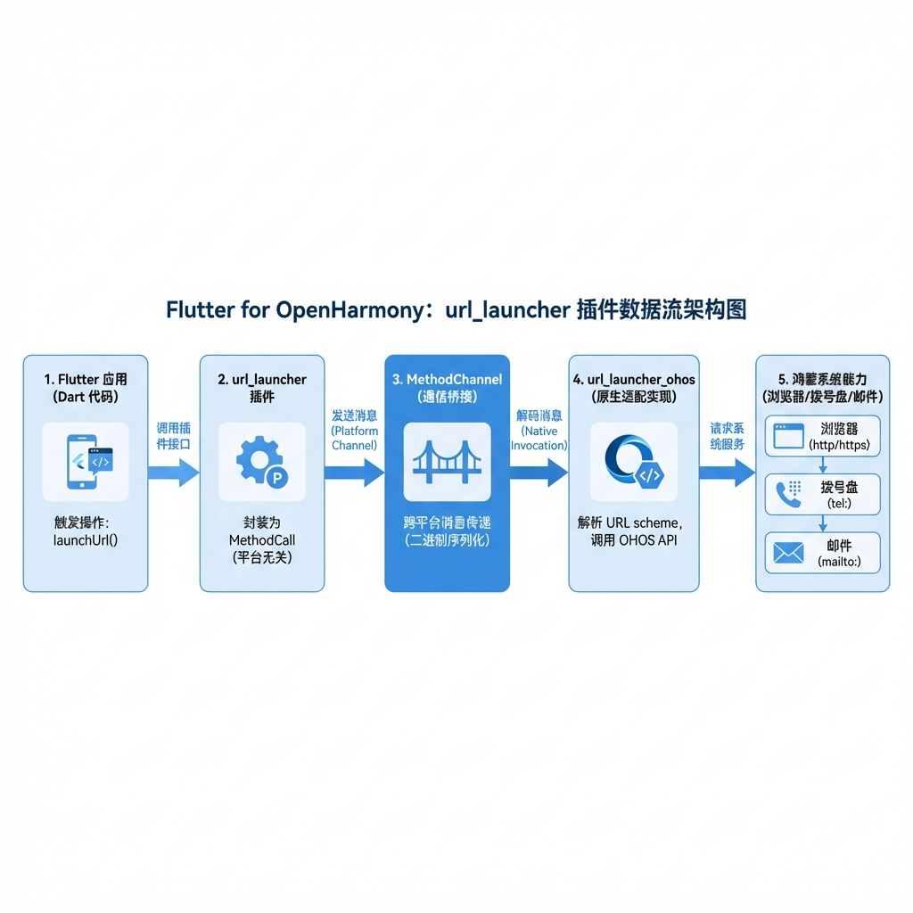
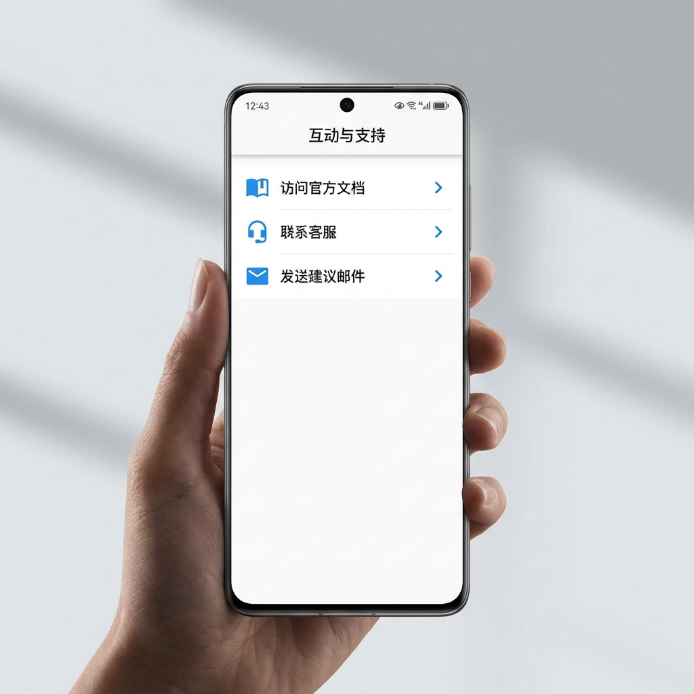

# Flutter for OpenHarmony 实战：url_launcher 插件 — 跨应用跳转与系统集成

## 前言

在现代移动应用中，跨应用交互是一项基础且关键的能力。无论是点击链接跳转浏览器、拨打客服电话、发送电子邮件，还是唤起地图导航，都离不开“拨号/跳转”这一核心逻辑。

在 Flutter 生态中，`url_launcher` 是实现这些功能的标准插件。随着 Flutter for OpenHarmony 的不断演进，我们现在也可以在鸿蒙设备上优雅地实现这些跨应用跳转逻辑。本文将详细介绍如何在鸿蒙环境下配置、使用 `url_launcher`，并解析其背后的适配细节。



---

## 一、 环境配置与依赖引入

在 OpenHarmony 上使用 `url_launcher`，我们需要引入专门为鸿蒙系统优化的适配包。

### 1.1 添加依赖

请在项目的 `pubspec.yaml` 文件中添加如下配置。建议直接使用 OpenHarmony TPC 仓库的源码依赖，以保持与系统能力的同步：

```yaml
dependencies:
  flutter:
    sdk: flutter

  # 1. 核心包
  url_launcher: ^6.1.11

  # 2. OpenHarmony 平台适配包
  url_launcher_ohos:
    git:
      url: https://atomgit.com/openharmony-tpc/flutter_packages.git
      path: packages/url_launcher/url_launcher_ohos
```

> 📌 **注意**：引入 `url_launcher_ohos` 后，Flutter 的构建系统会自动将其注册到宿主工程中，无需手动编写原生代码。

### 1.2 鸿蒙特有的权限配置 (querySchemes)

在 Android 和 iOS 上，我们习惯了直接调用 `canLaunchUrl`。但在 OpenHarmony 中，如果你需要检测某个特定的 Scheme（如私有协议）是否可达，你必须在 `ohos/entry/src/main/module.json5` 中手动声明这些协议，否则 `canLaunchUrl` 会由于沙箱限制始终返回 `false`。

```json5
{
  "module": {
    "querySchemes": [
      "tel",
      "mailto",
      "https",
      "http",
      "weixin",
      "snssdk1128", // 抖音
      "taobao"
    ],
    // ... 其他配置
  }
}
```

---

## 二、 核心用法实战

`url_launcher` 提供了一套统一的异步 API，涵盖了大部分常见的跳转场景。

### 2.1 基础：在外部浏览器打开链接

这是最常见的用法。在鸿蒙上，系统会根据 URL 类型自动唤起默认浏览器或对应的应用。

```dart
import 'package:url_launcher/url_launcher.dart';

Future<void> _launchInBrowser(String url) async {
  final Uri uri = Uri.parse(url);
  
  // 💡 最佳实践：总是先检测是否可唤起
  if (await canLaunchUrl(uri)) {
    await launchUrl(
      uri,
      // 📌 鸿蒙适配建议：使用外部应用模式
      mode: LaunchMode.externalApplication,
    );
  } else {
    print('❌ 无法打开该链接: $url');
  }
}
```

### 2.2 进阶：系统集成能力 (电话、邮件、短信)

`url_launcher` 能够将 `scheme` 协议无缝转化为鸿蒙的原生动作。

#### （1）拨打电话
```dart
final Uri telUri = Uri(scheme: 'tel', path: '4001234567');
await launchUrl(telUri);
```

#### （2）发送电子邮件
```dart
final Uri emailUri = Uri(
  scheme: 'mailto',
  path: 'support@example.com',
  queryParameters: {'subject': '反馈来自鸿蒙 App'},
);
await launchUrl(emailUri);
```

#### （3）发送短信
```dart
final Uri smsUri = Uri(scheme: 'sms', path: '10086');
await launchUrl(smsUri);
```

### 2.3 进阶：唤起主流第三方 App (Deep Linking)

在移动互联网时代，直接唤起第三方 App 完成闭环（如支付、关注）是刚需。

| 平台 | Scheme (协议头) | 常见用途 |
| :--- | :--- | :--- |
| **微信** | `weixin://` | 唤起微信首页、扫一扫 |
| **抖音** | `snssdk1128://` | 跳转短视频详情、用户主页 |
| **淘宝** | `taobao://` | 跳转商品详情、店铺 |
| **支付宝** | `alipays://` | 唤起支付、扫码 |

**代码实现示例：**

```dart
Future<void> _launchThirdPartyApp(String schemeUrl) async {
  final Uri uri = Uri.parse(schemeUrl);
  if (await canLaunchUrl(uri)) {
    // 💡 建议：对于三方 App，必须使用 externalApplication 模式
    await launchUrl(uri, mode: LaunchMode.externalApplication);
  } else {
    // 如果未安装，可以引导用户去应用市场
    print('未检测到相关应用');
  }
}

// 调用示例：唤起微信
// _launchThirdPartyApp('weixin://');

// 调用示例：唤起抖音并跳转到特定视频 (具体参数需查阅对应开放平台)
// _launchThirdPartyApp('snssdk1128://feed'); 
```



---

## 三、 深度适配：鸿蒙平台的差异化建议

虽然 `url_launcher` 隐藏了平台差异，但在 OpenHarmony 这个全新的生态下，有些细节需要开发者特别留意。

### 3.1 页面内嵌（In-app WebView）还是外部跳转？

在 `launchUrl` 的 `mode` 参数中，我们可以选择 `LaunchMode.inAppWebView`。
*   📌 **鸿蒙现状**：目前 `url_launcher_ohos` 在处理 `inAppWebView` 时，通常会尝试创建一个临时的容器页面。为了获得最原生的多任务切换体验，**强烈建议在鸿蒙上优先使用 `LaunchMode.externalApplication`**。这样用户可以通过鸿蒙的任务栏（Recents）在浏览器和你的 App 之间快速切换。

### 3.2 错误处理与用户反馈

与 Android 等系统不同，鸿蒙对应用的拉起有较为严格的生命周期管理。如果跳转失败，应用不应只是在后台报错。

✅ **推荐做法**：使用 `Theme.of(context)` 的颜色风格弹出一个 `SnackBar`，告知用户跳转失败的原因。

```dart
try {
  await launchUrl(uri);
} catch (e) {
  ScaffoldMessenger.of(context).showSnackBar(
    const SnackBar(content: Text('跳转失败，请检查是否安装了相关应用')),
  );
}
```

---

## 四、 完整示例分析：构建一个交互式反馈页面

下面是一个整合了多种跳转逻辑的实战代码片段，您可以直接将其集成到您的鸿蒙 Flutter 工程中。

```dart
import 'package:flutter/material.dart';
import 'package:url_launcher/url_launcher.dart';

class FeedbackPage extends StatelessWidget {
  const FeedbackPage({super.key});

  @override
  Widget build(BuildContext context) {
    return Scaffold(
      appBar: AppBar(title: const Text('互动与支持')),
      body: ListView(
        children: [
          _buildActionItem(
            context,
            icon: Icons.language,
            title: '访问官方文档',
            onTap: () => launchUrl(Uri.parse('https://flutter.cn')),
          ),
          _buildActionItem(
            context,
            icon: Icons.phone,
            title: '联系客服',
            onTap: () => launchUrl(Uri(scheme: 'tel', path: '123456')),
          ),
          _buildActionItem(
            context,
            icon: Icons.email,
            title: '发送建议邮件',
            onTap: () => launchUrl(Uri(scheme: 'mailto', path: 'dev@ohos.com')),
          ),
        ],
      ),
    );
  }

  Widget _buildActionItem(BuildContext context, {
    required IconData icon, 
    required String title, 
    required VoidCallback onTap
  }) {
    return ListTile(
      leading: Icon(icon, color: Colors.blue),
      title: Text(title),
      trailing: const Icon(Icons.arrow_forward_ios, size: 16),
      onTap: onTap,
    );
  }
}
```


---

## 五、 总结

`url_launcher` 完美实现了“一行代码，跨层跳转”。在 Flutter for OpenHarmony 的实际开发中，它不仅赋予了 App 处理网页的能力，更是通向系统原生核心服务（电话、短消息）的桥梁。

通过合理的权限预配置 (`querySchemes`) 和规范的 `mode` 选择，我们可以让鸿蒙用户享受到与系统应用一致的丝滑跳转体验。

---

> 📦 **完整代码已上传至 AtomGit**：[open-harmony-examples/url_launcher_demo](https://atomgit.com/dragonbady/open-harmony-examples/tree/main/examples/url_launcher_demo)
>
> 🌐 **欢迎加入开源鸿蒙跨平台社区**：[开源鸿蒙跨平台开发者社区](https://openharmonycrossplatform.csdn.net)
