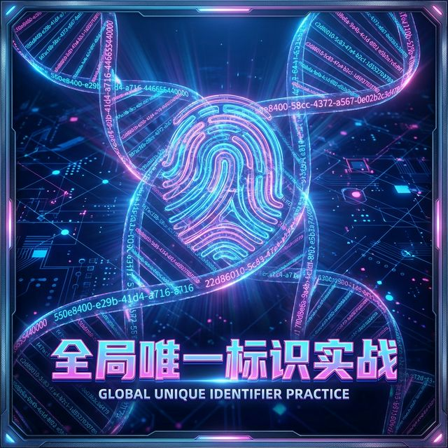

# Flutter for OpenHarmony 实战：uuid 插件生成唯一标识符的标准化方案



## 前言：为分布式协同赋予“灵魂编码”

在 **HarmonyOS NEXT** 构建的“万物互联”版图中，数据不再局限于单一设备，而是在手机、平板、智慧屏之间自由流转。为了确保这些分布式数据在合并、同步时不会发生主键冲突，每一个实体都必须拥有一个全球唯一的“灵魂编码”。

传统的数据库自增 ID 在离线同步场景下极易“撞车”，而 **`uuid`** 插件生成的 128 位标识符则是解决这一痛点的国际标准。本文将带你掌握如何在鸿蒙应用中优雅地管理这些分布式 ID。

---

## 一、 为什么在鸿蒙开发中必须使用 UUID？

### 1.1 彻底抹平多端同步冲突
在分布式数据库（如基于鸿蒙分布式软总线的同步）中，不同设备可能在同一毫秒创建记录。UUID 凭借其巨大的值域空间，确保了即使在完全离线、不依赖中心服务器的情况下，每一台鸿蒙设备生成的记录 ID 都是独一无二的。

### 1.2 增强安全防御与隐私保护
自增 ID 容易暴露业务规模（如爬虫探测），并可能引发越权攻击风险。UUID 的无序性为鸿蒙应用提供了一层天然的“混淆屏障”，防止攻击者根据 ID 的连续性探测系统内部逻辑。

### 1.3 赋能全网链路追踪
在鸿蒙端性能分析或多设备协同日志排查中，我们需要一个能在不同子系统中流转的 TraceID。UUID 是构建这种跨进程、跨设备追踪链路的最佳选择。

---

## 二、 技术内幕：拆解 UUID 主流版本策略

### 2.1 V4 (Random)：最通用的随机方案（首选）
V4 完全依赖高熵随机数生成。在鸿蒙 Flutter 开发中，这是应用最广的版本，适用于绝大多数业务逻辑 ID。

### 2.2 V1 (Time-based)：追求顺序的性能方案
基于时间戳与时钟序列。它具有良好的物理顺序性，对于底层数据库索引非常有益，但要注意它在某种程度上会暴露生成的时间特征。

### 2.3 V5 (Name-based)：确定性的逻辑映射
基于命名空间和 SHA-1 哈希。它可以确保“相同的输入永远产生相同的 UUID”，这对于跨设备的用户标识映射或文件指纹生成非常有用。

---

## 三、 集成指南

### 3.1 添加依赖
```yaml
dependencies:
  uuid: ^4.5.1
```

### 3.2 快速调用示范
```dart
import 'package:uuid/uuid.dart';

// 推荐在全局或单例 Service 中定义
const uuid = Uuid();

// 生成随机 ID (v4)
String id = uuid.v4(); 

// 生成确定性 ID (v5)
String dnsId = uuid.v5(Namespace.url.value, 'harmonyos.com');
```

---

## 四、 鸿蒙平台的极致适配建议

### 4.1 性能优化：单例与对象池
虽然 UUID 生成速度极快，但在处理批量导入（如初始化 10000 条演示数据）时，频繁创建 `Uuid` 构造函数仍会有微小开销。建议使用 `static const` 或单例模式管理生成器。

### 4.2 交互增强
在鸿蒙 UI 交互中，对于生成的 ID，建议提供“点击拷贝”功能。配合 Flutter 的 `Clipboard` 接口，可以提升调试与管理的便捷性。

---

## 五、 实战示例：分布式 ID 实验室

以下是我们在示例项目中实现的完整演示页面：

```dart
import 'package:flutter/material.dart';
import 'package:flutter/services.dart';
import 'package:uuid/uuid.dart';

class UuidDemoPage extends StatefulWidget {
  const UuidDemoPage({super.key});

  @override
  State<UuidDemoPage> createState() => _UuidDemoPageState();
}

class _UuidDemoPageState extends State<UuidDemoPage> {
  static const _uuid = Uuid(); // 💡 亮点：单例管理提升性能
  final List<String> _ids = [];

  void _generate(String type) {
    setState(() {
      String newId = type == 'v4' ? _uuid.v4() : _uuid.v1();
      _ids.insert(0, newId);
    });
  }

  @override
  Widget build(BuildContext context) {
    return Scaffold(
      appBar: AppBar(title: const Text('鸿蒙分布式 ID 实验室')),
      body: ListView.builder(
        itemCount: _ids.length,
        itemBuilder: (context, index) => ListTile(
          leading: const Icon(Icons.fingerprint),
          title: Text(_ids[index], style: const TextStyle(fontSize: 12)),
          onTap: () => Clipboard.setData(ClipboardData(text: _ids[index])),
        ),
      ),
      bottomNavigationBar: BottomAppBar(
        child: Row(
          mainAxisAlignment: MainAxisAlignment.spaceEvenly,
          children: [
            ElevatedButton(onPressed: () => _generate('v4'), child: const Text('随机 V4')),
            OutlinedButton(onPressed: () => _generate('v1'), child: const Text('时序 V1')),
          ],
        ),
      ),
    );
  }
}
```

---

## 六、 总结

在 **HarmonyOS NEXT** 的万物互联架构下，掌握标准化的唯一标识符生成技术，是构建健壮分布式应用的基石。通过 `uuid` 插件，我们不仅解决了数据冲突的工程难题，更通过规范的算法策略提升了应用的安全性与扩展性。

---

🌐 **欢迎加入开源鸿蒙跨平台社区**：[开源鸿蒙跨平台开发者社区](https://openharmonycrossplatform.csdn.net)
