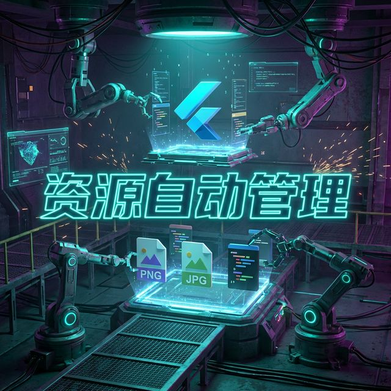

# Flutter for OpenHarmony 实战：Flutter Gen — 告别手写字符串的资产工厂



## 前言

在进行 **Flutter for OpenHarmony** 开发时，管理本地资源（Assets）是一个必经但又极易出错的环节。你是否曾经因为手写了一个错误的图片路径（如 `Assets.images.logo_png` vs `Assets.images.logo.png`）而导致应用在真机上运行时莫名奇妙的白屏或报错？

随着鸿蒙应用规模的增大，手动维护上百个图片的路径字符串简直是开发者的噩梦。**Flutter Gen** 是一款通过代码生成技术，将你的图片、颜色、字体资产转换为强类型对象的终极工具。它能让你在编写代码时，像调用类属性一样引用任何资源。本文将带你探索如何彻底终结“手写硬编码字符串”的历史。

---

## 二、为什么大型鸿蒙项目必须引入 Flutter Gen？

### 2.1 编译期错误检查 🛡️
如果资产文件被重命名或删除，运行代码生成器后，引用处会直接在编译期报错（Compiler Error），而不是在鸿蒙真机运行到那一页时才尴尬地报错。

### 2.2 极致的开发效率
配合 IDE（如华为 DevEco Studio）的自动补全功能，输入 `Assets.` 后，所有可用的图片、Lottie 动画都会通过下拉列表列出。开发者甚至不需要打开资源管理器确认文件名。

<!-- IMAGE_PLACEHOLDER: [传统资源引用 vs Flutter Gen 强类型引用对比图] -->
<!-- 类型: 示例对比 -->
<!-- 内容: 展示一段易错的字符串路径引用与一段优雅的 Assets 对象引用的视觉差异 -->

---

## 三、配置环境 📦

在项目中配置基础库及代码生成器：

```yaml
dependencies:
  flutter_gen: ^5.12.0

dev_dependencies:
  flutter_gen_runner: ^5.12.0
  build_runner: ^2.4.0
```

提示：这是开发阶段使用的工具，不会增加任何运行时性能负担。

---

## 四、核心功能：3 个效率翻倍的场景体验

### 4.1 强类型图片引用 (Image Assets)
再也不用写 `Image.asset('assets/images/header.png')`。
```dart
import 'package:ohos_app/gen/assets.gen.dart';

void showLogo() {
  // 💡 技巧：生成的对象自带 image 方法，可直接传入宽高
  final logo = Assets.images.ohosLogo.image(
    width: 120,
    fit: BoxFit.cover,
  );
}
```

### 4.2 统一颜色资产管理 (Color Assets)
将 UI 规范定义的颜色汇总管理。
```dart
import 'package:ohos_app/gen/colors.gen.dart';

// 💡 技巧：如果是通过 flutter_gen 生成的，直接引用属性
final bgColor = ColorName.harmonyBlue;
```

### 4.3 矢量图（SVG）与字体的高阶支持
```dart
// 支持 flutter_svg 自动集成
final icon = Assets.icons.search.svg();
```

---

## 五、OpenHarmony 平台资源适配建议

### 5.1 资源冲突的预防 🏗️
⚠️ **注意**：鸿蒙 DevEco Studio 的资源编译系统对文件名有其独特校验。
- **✅ 建议做法**：利用 `flutter_gen` 配置项中的 `exclude` 功能，排除掉鸿蒙原生层（ohos 目录）的混淆资源或临时构建文件，防止生成的 Dart 代码中包含非法的资源标识符。

### 5.2 大规模资产的性能优化
- **💡 技巧**：在鸿蒙端，如果图片资源过多（如超过 500 张），建议在 `pubspec.yaml` 中将资产分类存放。Flutter Gen 可以通过子目录（Sub-directories）生成嵌套的命名空间，保持代码的高度整洁：`Assets.images.home.banner1.image()`。

<!-- IMAGE_PLACEHOLDER: [DevEco Studio 代码补全 Assets 示例截图] -->
<!-- 类型: 截图 -->
<!-- 内容: 展示在编写代码时，IDE 自动联想出所有资产文件名的丝滑体验 -->

---

## 六、完整实战示例：构建鸿蒙应用一站式资源工厂

我们将模拟一个生产环境的 `Mason` 级架构：通过 Flutter Gen 管理图片、Lottie 动画和 SVG 资源。

```yaml
# pubspec.yaml 中的 FlutterGen 配置
flutter_gen:
  output: lib/gen/ # 指定生成目录
  integrations:
    flutter_svg: true
    lottie: true
```

**应用侧实战逻辑：**

```dart
import 'package:flutter/material.dart';
import '../gen/assets.gen.dart'; // 引入生成的工厂类

class OhosGallaryPage extends StatelessWidget {
  const OhosGallaryPage({super.key});

  @override
  Widget build(BuildContext context) {
    return Scaffold(
      appBar: AppBar(title: const Text('自动化资产工厂')),
      body: Center(
        child: Column(
          children: [
            // 1. 实战：强类型引用本地鸿蒙图标
            Assets.images.brandLogo.image(height: 80),

            // 2. 实战：引用 SVG 并自动处理 tint 颜色
            Assets.icons.themeSetting.svg(
              colorFilter: const ColorFilter.mode(Colors.blue, BlendMode.srcIn),
            ),

            // 3. 实战：引用 Lottie 动画
            Assets.animations.loadingMain.lottie(
              repeat: true,
              animate: true,
            ),
          ],
        ),
      ),
    );
  }
}
```

---

## 七、总结

`Flutter Gen` 是将 **Flutter for OpenHarmony** 开发质量从“石器时代”带入“工业时代”的关键拼图。它消除了手动拼接路径这种毫无意义的工作，将开发者的精力重新聚焦在核心业务逻辑与 UI 交互上。

在一个追求极致效率的鸿蒙团队中，Flutter Gen 应当是每一个项目的标配。

---

🌐 **欢迎加入开源鸿蒙跨平台社区**：[开源鸿蒙跨平台开发者社区](https://openharmonycrossplatform.csdn.net)
