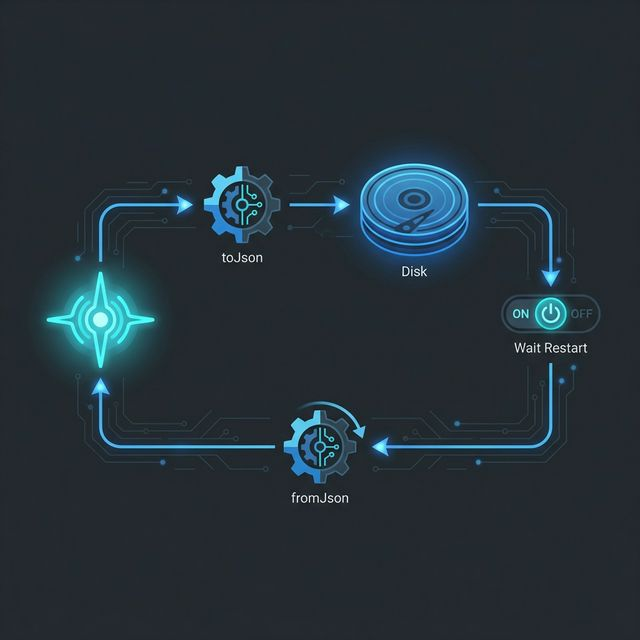

# Flutter for OpenHarmony 实战：Hydrated BLoC — 赋予状态长久记忆的能力


## 前言

在进行 **Flutter for OpenHarmony** 开发时，处理数据的“持久化”往往是件头疼事。比如：用户选择的深色模式、收藏的歌曲列表、或者是表单填到一半的内容。如果每次应用退出（Cold Start）后所有状态都消失，用户体验将大打折扣。

手动使用 `SharedPreferences` 在每个状态变更点去 `save()`，在 `init` 时去 `load()` 显得极其繁琐且易错。**Hydrated BLoC** 提供了一套全自动的“水合方案”：它能自动将你的业务状态（State）映射到鸿蒙本地文件系统中，让应用无论重启多少次，都能瞬间找回上一秒的感觉。

> **📚 术语解析：什么是“水合” (Hydration)？**
>
> 这是一个生动的比喻。应用关闭时，我们将内存中鲜活的状态（State）存入硬盘，这个过程叫**“脱水”**；当应用重新启动，我们从硬盘读取数据并还原为内存对象，这个过程就像给干枯的植物补充水分，使其恢复生机，故称**“水合”**。它的核心价值在于**“状态持久化”**。

---

## 一、Hydrated BLoC 的核心机制

### 1.1 自动化的 JSON 序列化 🧬
Hydrated BLoC 内部集成了存储引擎。你只需要告诉它如何将状态转换为 JSON（toJson），以及如何从 JSON 还原状态（fromJson）。其余的读写时机，它会根据 BLoC 的 `state` 变更自动完成。

### 1.2 高性能的磁盘 I/O
为了保证不阻塞鸿蒙设备的 UI 主线程，它采用了顺序追加的二进制存储模型。解析速度极快，确保鸿蒙应用在启动时“即点即用”，无需等待长长的进度条。



---

## 二、配置环境 📦

引入核心包及其配套的存储库：

```yaml
dependencies:
  hydrated_bloc: ^9.1.5 # 鸿蒙实战推荐稳定版本
  path_provider: ^2.1.2 # 用于获取鸿蒙沙箱路径
```

在鸿蒙应用的 `main()` 中利用静态赋值方式初始化存储，避开复杂的异步 Zone 冲突：

```dart
import 'package:hydrated_bloc/hydrated_bloc.dart';
import 'package:path_provider/path_provider.dart';

Future<void> main() async {
  // 💡 技巧 1：全部在 Root Zone 内顺序执行，零 Zone 切换，彻底告别 Zone mismatch 报错
  WidgetsFlutterBinding.ensureInitialized();

  // 💡 技巧 2：构建持久化存储（存放在鸿蒙应用私有沙箱路径下）
  HydratedBloc.storage = await HydratedStorage.build(
    storageDirectory: await getTemporaryDirectory(),
  );

  runApp(const MyApp());
}
```

---

## 三、深度解析：状态的生命周期 (内存 vs 磁盘)

理解“水合”的过程对调试至关重要。状态的流动遵循以下闭环：

| 阶段 | 动作 | 触发时机 | 数据流向 |
| :--- | :--- | :--- | :--- |
| **水合 (Hydrate)** | `fromJson()` | BLoC 实例**创建时** | 磁盘 💾 → 内存 🧠 |
| **同步 (Sync)** | `toJson()` | 每次执行 `emit(newState)` | 内存 🧠 → 磁盘 💾 |
| **销毁 (Dispose)** | `dispose()` | 页面销毁或 BlocProvider 卸载 | 内存 🧠 ❌ |

**💡 实验心得**：
如果你在运行中执行了 `clear()` 清理存储，内存中现有的 BLoC 实例依然保持着数据。你必须通过 **Hot Restart**（热重启）或销毁该 BLoC 实例再重新进入，新实例在初始化时发现磁盘为空，才会恢复到 `super()` 定义的初始状态。

---

## 三、核心功能：3 个场景化进阶用法

### 3.1 极简的主题记忆控制器
让用户的色彩偏好永不丢失。
```dart
class ThemeBloc extends HydratedBloc<ThemeEvent, ThemeMode> {
  ThemeBloc() : super(ThemeMode.light);

  @override
  // 💡 技巧：增加 try-catch 容错。防止磁盘数据损坏或版本不一致导致应用启动闪退。
  ThemeMode? fromJson(Map<String, dynamic> json) {
    try {
      return ThemeMode.values[json['mode'] as int];
    } catch (_) {
      return null; // 返回 null 则自动使用 super 初始值，保证健壮性
    }
  }

  @override
  // 💡 技巧：状态变更后自动触发此方法保存
  Map<String, dynamic>? toJson(ThemeMode state) => {'mode': state.index};
}
```

### 3.2 复杂的列表数据过滤缓存
保存用户在鸿蒙分屏（Split Screen）模式下设定的多级筛选条件。
```dart
@override
Map<String, dynamic>? toJson(FilterState state) {
  // 只持久化关键 ID 列表，忽略掉临时的 UI 点击位置
  return {'selected_ids': state.ids};
}
```

### 3.3 状态的快速重置 (Clear Storage)
在用户注销鸿蒙账号时，一键抹除所有已保存的状态。
```dart
void logout() async {
  await HydratedBloc.storage.clear(); // 物理清理所有持久化文件
}
```

---

## 四、OpenHarmony 平台适配建议

### 4.1 数据的物理安全性保护 🏗️
⚠️ **注意**：鸿蒙系统具有深度的沙箱机制。
- **✅ 建议做法**：虽然文件存在在 `Document` 目录下，但对于高度敏感的数据（如私钥、支付凭证），不要直接利用 Hydrated BLoC 的默认明文 JSON 存储。建议配合加密库在 `toJson` 时先对 Value 字段进行一层 AES 处理。

### 4.2 适配鸿蒙多实例（Atomic Service）运行
- **💡 技巧**：在鸿蒙元服务（原子化服务）轻巧的运行环境下，单文件存储可能比数据库更有优势。通过 Hydrated BLoC，你可以确保即使用户在“最近任务”中滑掉了卡片，下次点开磁贴时，关键的操作进度依然存在。

<!-- IMAGE_PLACEHOLDER: [鸿蒙真机应用冷启动状态恢复截图] -->
<!-- 类型: 截图 -->
<!-- 内容: 展示关闭应用后重新打开，UI 上的数值和选项依然保留在上次关闭时刻的效果 -->

---

## 五、完整实战示例：构建鸿蒙应用“全感官”动态持久中心

我们将模拟一个工业级的配置管理器：它不仅记录用户的黑夜模式，甚至能记住用户录音时的音量大小，并在应用重启后由系统自动调回设定值。

```dart
import 'package:hydrated_bloc/hydrated_bloc.dart';

/// 鸿蒙配置状态模型
class OhosAppSettings {
  final double volume;
  final bool isVipMode;
  OhosAppSettings(this.volume, this.isVipMode);
}

/// 鸿蒙级配置同步引擎
class SettingsBloc extends HydratedBloc<double, OhosAppSettings> {
  SettingsBloc() : super(OhosAppSettings(0.5, false));

  // 1. 实战：处理业务逻辑
  void setVolume(double val) => emit(OhosAppSettings(val, state.isVipMode));

  @override
  // 2. 💡 实战：将磁盘 JSON 映射回鸿蒙应用内存
  OhosAppSettings? fromJson(Map<String, dynamic> json) {
    print('📂 鸿蒙持久化层：正在水合配置数据...');
    return OhosAppSettings(json['vol'], json['vip']);
  }

  @override
  // 3. 💡 实战：状态任何一处变动，自动同步到鸿蒙本地文件系统
  Map<String, dynamic>? toJson(OhosAppSettings state) {
    return {'vol': state.volume, 'vip': state.isVipMode};
  }
}

void main() async {
  // 模拟业务逻辑
  final bloc = SettingsBloc();
  bloc.setVolume(0.8); // 系统自动异步执行磁盘写入
  
  print('✅ 设定执行成功，下次启动将自动恢复至 80% 音量');
}
```

---

## 六、总结

`Hydrated BLoC` 彻底抹平了“状态”与“持久化”之间的鸿沟。在 **Flutter for OpenHarmony** 构建中，利用这一特性，你可以轻松实现诸如“上次播放进度”、“离线问卷断点续填”等高级功能。

记住，一个懂礼貌的应用，永远会默默记住用户上次的选择。

---

🌐 **欢迎加入开源鸿蒙跨平台社区**：[开源鸿蒙跨平台开发者社区](https://openharmonycrossplatform.csdn.net)
